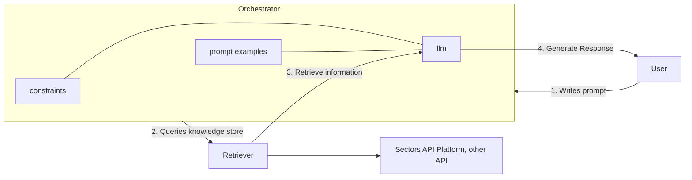

## A Primer on Generative AI and LLMs

Generative AI is a subset of artificial intelligence that focuses on creating new, original 
content by learning from existing data. This is in contrast to more conventional AI applications 
where the task is to predict or classify data. 

A subset of Generative AI that is gaining popularity is the use of Large Language Models (LLMs). These 
are models trained on large amounts of text data -- such as books, articles, websites and online forums -- to generate
human-sounding text. A common example of an LLM is OpenAI's GPT-3, which has been used to generate
everything from poetry to writing code. Outside of text generation, the same principles that underlie 
LLMs can be applied to other types of data, such as images and music, opening a new frontier of 
possibilities for creative applications.

In some cases, the model is fed with such an enormous amount of data across both textual and non-textual
data that it can support text-generation tasks but also understand images and other forms of data. These 
types of models are referred to as _multimodal models_.

## Large Language Models in Finance
As Generative AI and LLMs mature and become more sophisticated, these models will make their way
into more an array of use-cases that extend beyond creative writing. In the following 4 sub-sections, we'll 
explore example applications of Generative AI in the financial industry.

### 1. Generative AI for Financial Data Summarization
One of the most immediate applications of Generative AI in finance is in the retrieval and summarization
of financial data. For example, a Generative AI model could be trained on a large corpus of financial reports 
and filings such that it learn the structure and content pattern of these documents. When asked to provide 
a summary of a new financial report, the model could generate a concise summary that captures the essence of 
the original information, providing the financial analyst with a quick overview of the report along with 
key insights and trends.

### 2. Generative AI for Database Queries and Data Retrieval
Another application of Generative AI in finance is in the area of database queries and data retrieval. Instead of 
requiring a financial analyst to write complex SQL queries that extract data from a database, a Generative AI model
could be trained to understand natural language queries and generate the corresponding SQL query. This would
allow financial analysts to interact with databases in a more intuitive and efficient manner, freeing up time
for interpreting the results of these queries that would otherwise be lost on writing queries in a language that 
is not in their primary domain.

### 3. Generative AI as Logical Reasoning Engines
The financial industry is notorious for its complex rules and regulations that govern the behavior of financial
instruments and institutions. Generative AI models can be trained to understand these rules and regulations and
generate logical reasoning chains that explain why a particular financial instrument is behaving in a certain way.
This can be particularly useful in the context of regulatory compliance and risk management, where 
financial institutions are required to provide explanations for their actions and decisions. Beyond that, a fund 
manager or equity researcher could also employ these LLM models to generate investment theses and strategies, or 
construct stock screening criteria that involve a series of reasoning steps that are not easily captured by 
traditional rule-based systems.

### 4. Conversational AI for Financial Advisory
LLMs and other Generative AI models can also be used to create conversational AI agents that combine their abilities in 
(1) understanding natural language queries, (2) retrieving relevant information from a database, and finally (3) 
generating responses that are coherent and informative. This can be particularly useful in the context of financial
advisory services, where a customer might ask a question about their investment portfolio or the state of the market,
and the AI agent can provide a detailed response that is tailored to the customer's needs and level of understanding, along 
with knowledge of the customer's investment history and preferences.

## _General-purpose LLMs are not the answer_

> LLMs' problems come down to four:
> 
> - LLM training data tends to be out-of-date (ChatGPT's knowledge cutoff is on January 2022).
> - LLMs extrapolate with generic information when facts aren't available, confidently making false but plausible-sounding statements when there's a gap in their knowledge.
> - Incorporation of actual financial data in the training process might be limited due to confidentiality concerns, and 
>   the model's ability to interact with uploaded financial data also poses a security risk.
> - Generating inaccurate responses due to terminology confusion (we'll see an example below regarding the abbreviation "p.e"), or 
>   presenting generic information wher users expect financial-specific, current information.

But before you go off and start connecting your database to a public, general-purpose LLM, you should be aware of the
risks and limitations of using these models in a financial context. First of all, there's the issue of **privacy and 
data confidentiality**. If you're feeding sensitive financial data into a public model, you're essentially sending your data 
up to the cloud where its security and privacy are not guaranteed. Secondly, there's also the issue of **being overly generic** 
and hence lacking the specificity and financial domain knowledge required to model financial data accurately. 
A general-purpose LLM might occasionally generate text that sounds plausible, but when it's wrong ("model **hallucination**"), it's 
really wrong and **could lead to disastrous consequences**.

Thirdly, if your application of Generative AI requires up-to-date, real-time data that **sits in a proprietary database**, you 
might find that general-purpose LLMs publically available (e.g. ChatGPT) extremely limited in their utility as a financial advisory 
or data retrieval tool. This is because these models are trained on a fixed dataset and typically do not have the ability to 
interact with external data sources or update their training data in real-time, relying on their **knowledge cutoff dates**, or the
latest date at which the information was used to train the model.

### Incremental Training for Task-Specific Financial LLMs
To address these limitations, one could consider looking into task-specific LLMs that are further trained 
on top of a base LLM model for a specific financial task. For example, a financial portfolio service might 
extend a general-purpose base LLM with additional training on financial data and market trends, such that its 
responses becoming more formulaic in nature and less prone to hallucination. This borrows from the concept of "transfer learning", 
where a model is trained on a large dataset and then fine-tuned on a smaller, more specific dataset to improve its performance on
specific tasks.

**Disadvantages**: The downside of this approach is that it requires considerably more computational resources to 
afford the incremental training, and the resulting model might be overly rigid and heavily dependent on 
continual training, or incremental training, to keep up with the latest trends in the financial market.

Overall satisfaction: &nbsp;
<Icon icon="star" size={24} />
<Icon icon="star" size={24} />
<Icon icon="star-half" size={24} />

### Domain-Specific LLMs
Another approach to mitigating the risks of using general-purpose LLMs in finance is to develop a model from scratch trained primarily
on finance data. This approach is even more resource-intensive than the incremental training approach, but it offers the advantage of
being able to tailor the model to the unique terminology and complexity of the financial domain. BloombergGPT is one such example 
of a finance-specific LLM, trained on financial language documents collected over the span of forty years to create a 
363 billion token dataset. In contrast to task-specific LLMs, domain-specific LLMs need not be constrained to a single task,
but are often designed to be more versatile and diverse in the scope of their applications -- as long as they are within the
financial domain.

**Disadvantages**: The clear disadvantage of this approach is the high cost of data collection and annotation, as well as the prohibitive
cost of training and maintaining such a highly specialized model. Unlike general purpose LLMs, domain-specific LLMs are not easily 
transferable to other domains and require a significant up-front investment without the guarantee of a return. An overly specialized 
model might also be less robust to changes in the financial market and general economic conditions that are not captured in the narrowly scoped training data.

Overall satisfaction: &nbsp;
<Icon icon="star" size={24} />
<Icon icon="star" size={24} />
<Icon icon="star" size={24} />
<Icon icon="star-half" size={24} />

<Card title="ChatGPT 4o, out of the box"  icon="flask">
The acronym "P.E." can stand for various terms depending on the context. Some of the most common meanings include:
<ul>
<li>
- Physical Education: A school subject focusing on physical exercise and sports.
</li>
<li>
Professional Engineer: A licensed engineer who meets the qualifications and standards set by a professional engineering body.
</li>
<li>
Private Equity: Investments made directly into private companies or buyouts of public companies.
</li>
<li>
Public Enemy: A term used to describe a person or group considered a threat to the public or societal order.
</li>
<li>
Post Edition: A term used in publishing or translation referring to the review and correction of text after the initial draft.
</li>
</ul>
</Card>

Comparing this to the same prompt, but using a domain-specific LLM or a RAG model, we get a significantly different answer:

<Card title="ChatGPT 4o, specialized"  icon="flask">
P.E. stands for Price-to-Earnings Ratio. This is a financial metric used to evaluate the valuation of a company's stock. The P.E. ratio is calculated by dividing the current share price by the company's earnings per share (EPS). It can be expressed as:
 
$$\text{P/E Ratio} = \frac{\text{Price per share}}{\text{Earnings per share}}$$
 

The P.E. ratio helps investors assess whether a stock is overvalued, undervalued, or fairly valued compared to its earnings. A high P.E. ratio might suggest that the stock is overvalued or that investors expect high growth rates in the future. Conversely, a low P.E. ratio might indicate that the stock is undervalued or that the company is experiencing difficulties.

It's an essential tool for comparing companies within the same industry and for making informed investment decisions.
</Card>

## Retrieval Augmented Generation (RAG)
Retrieval Augmented Generation (RAG) refers to a set of strategy that address LLm hallucinations and the aforementioned knowledge cutoff problem 
by **augmenting the model with an information retrieval system**. By pairing the typical generative capabilities of an LLM with a retrieval system and 
calibrated system prompts, the LLM model are able to generate responses using precise, up-to-date information retrieved from an 
external knowledge store. 

Unlike the domain-specific or task-specific LLMs, RAG isn't necessarily a model in itself, as its training data might still be based on a general-purpose LLM and 
remained unaltered. Instead, it extends existing LLMs by providing getways to external knowledge sources, such as a database, so a knowledge base can form 
the basis of the model's responses without the need for incremental training or domain-specific data.

**Disadvantages**: Successful implementation of RAG requires a reliable, up-to-date and often-times pre-determined knowledge store that can be queried by the model. 
RAG can also be considered task-specific in that is functionally specialized to the knowledge store it is paired with, and might not offer the breadth of functionality as a domain-specific finance LLM.

Overall satisfaction: &nbsp;
<Icon icon="star" size={24} />
<Icon icon="star" size={24} />
<Icon icon="star" size={24} />
<Icon icon="star" size={24} />

### RAG implementation architecture
The essence of RAG involves three key components:
1. **Orchestrator**: This is the user's interface to the model, where the user inputs a query or request. The orchestrator then takes said input, determine the appropriate retrieval strategy, and pass the query to the retriever. A popular framework for 
    the orchestration layer is LangChain. 
2. **Retriever**: This component is responsible for retrieving relevant information from the knowledge store based on the input query. The retriever can be a simple keyword-based search engine or a more sophisticated system that uses semantic search techniques to find the most relevant information.
    It can be made up of a variety of systems, such as databases, ElasticSearch, or API-based retrieval systems.
3. **LLM**: The large language model that interpret the initial query and subsequently generate a coherent response based on the retrieved information. 

As we start to write code, we'll get to see how these components interact with each other to create a seamless, information-rich experience for the user. 
On a high level, the orchestrator that we implement will:
- Take a user query as input
- Connects said query to the right retrieval tool, or tools, as needed
- Retrieve the relevant information from the knowledge store
- Kick this information to the LLM to generate contextually relevant, informed, rich responses.

When developing our RAG system, we'll also configure our orchestrator with some RAG-specific prompting strategies to ensure that the LLM generates responses that are
informed by the retrieved information. This might involve providing the LLM with a summary of the retrieved information, or asking the LLM to generate a response that
incorporates the retrieved information in a meaningful way. The orchestration step is also where we add additional 
constraints and validations to ensure that the LLM follow as predictable a path as possible when generating responses, especially when the retrieved information is
financially sensitive or requires a high degree of accuracy.

### API-based retrieval systems

As seen from the diagram above, the orchestrator is the central component that connects the user to the retriever and the LLM. The orchestrator is responsible for
taking the user's input, determining the appropriate retrieval strategy, and passing the query to the retriever. The retriever then retrieves the relevant information
from Sectors financial data layer, and passes this information back to the LLM for response generation. 

When using a framework such as LangChain, the orchestrator can be configured with a variety of RAG-specific prompting strategies as well as 
different Large Language Models in a fairly modular, plug-and-play fashion. This allows for a high degree of flexibility in the design of the RAG system, which 
we will see in the code examples that follow in this series.
