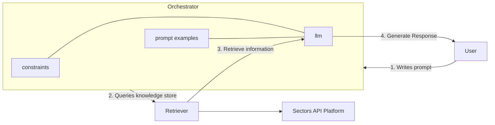

## API-based RAG systems architecture
We've learned from the [previous chapter](/recipes/generative-ai-python/01-background) that we can use APIs to retrieve data from the web. In this chapter, we'll learn how to use APIs to retrieve data from the web and use it to build a simple financial model.
We've also seen how such a system falls into a broader category of systems that are referred to as Retrieval-Augmented Generation (RAG) 
models. 

Rather than generating text solely from scratch, RAG models such as the one we'll build in this chapter use information retrieved from an external data source to 
form the basis of their text generation. Let's take one more look at the architecture of our API-based RAG system:



Broadly speaking, the system consists of three main components:
1. **Orchestrator**: We will be implementing this is Python using the LangChain framework. This script will be responsible for taking in the user's input and passing it to the retriever and LLM components along with some pre-defined constraints.
2. **Retriever**: We will create tools that retrieve data from Sector's, a financial API platform. These retrievers are in the form of some Python functions that take in some parameters and retrieve data accordingly from our data source ("Sectors API").
3. **LLM**: The language model we will be using is `llama3-groq-70b-8192-tool-use-preview`, which is [state-of-the-art and finetuned](https://wow.groq.com/introducing-llama-3-groq-tool-use-models/) specifically for tool use.

> Llama-3-Groq-70B-Tool-Use is the highest performing model on the Berkeley Function Calling Leaderboard (BFCL), outperforming all other open source and proprietary models.
> Our models have achieved remarkable results, setting new benchmarks for Large Language Models with tool use capabilities:
> - Llama-3-Groq-70B-Tool-Use: 90.76% overall accuracy (#1 on BFCL at the time of publishing)
> - Llama-3-Groq-8B-Tool-Use: 89.06% overall accuracy (#3 on BFCL at the time of publishing)

<Accordion title="Tip: Other tool-use models" icon="lightbulb">
 Other state-of-the-art Groq models that support tool use:
- llama-3.1-405b-reasoning
- llama-3.1-70b-versatile
- llama-3.1-8b-instant
- llama3-70b-8192
- llama3-8b-8192
- mixtral-8x7b-32768
- gemma-7b-it
- gemma2-9b-it
</Accordion>

## Practice: Building a RAG System

<Card title="Available as a Colab notebook" horizontal icon="notebook" href="https://colab.research.google.com/drive/1PjCGECqB37_TDD3kLHYl3IljlWxPNoXe?usp=sharing">
  This tutorial is also available as a Colab notebook. Click here to access it.
</Card>

For the remainder of this section, you will need to set up your environment along with the 
necessary dependencies. You can do this by running the following commands:


```bash
pip install requests
pip install langchain
pip install langchain-groq
```

In a new Python file, you should be able to initiate a request with your key:
```python
import requests

headers = {
    # your Sectors API key
    "Authorization": "7c39xxxxxxxxxxxxxxxxxxxxxxxxxxxxxxxxxxxxxxxxxxxxxxxxxxxxx"
}

def get_overview(stock: str, section: str) -> requests:
    url = f"https://api.sectors.app/v1/company/report/{stock}/?sections={section}"
    response = requests.get(url, headers=headers)
    return response

response = get_overview("BBRI", "financials")
print(response.json())
```

Since we'll be using a model hosted on Groq, we'll also need an API key obtained from Groq. You can sign up for a free account [here](https://console.groq.com/keys).
With both keys in hand, you can start setting up our script and load the keys into our environment.

I'm using `dotenv` to load my keys from a `.env` file. You can install it by running `pip install python-dotenv` and create a `.env` file in the same directory as your Python script with the following content:
```bash
GROQ_API_KEY=your_groq_api_key
SECTORS_API_KEY=your_sectors_api_key
```

And our Python script should look like this:
```python
import os
import json
import requests
from dotenv import load_dotenv

load_dotenv() # load your .env file
GROQ_API_KEY = os.getenv("GROQ_API_KEY")
SECTORS_API_KEY = os.getenv("SECTORS_API_KEY")

def retrieve_from_endpoint(url: str) -> dict:
    headers = {"Authorization": SECTORS_API_KEY}

    try:
        response = requests.get(url, headers=headers)
        response.raise_for_status()
        data = response.json()
    except requests.exceptions.HTTPError as err:
        raise SystemExit(err)
    return json.dumps(data)
```

Notice that `retrieve_from_endpoint` is just a convenience function 
that we can use to retrieve data from the Sectors API. We are creating 
an abstraction layer so we can re-use this function throughout our script.

### Building tools for our tool-use model
Now that we have our data retrieval function, we can start building a set of 
tools, each tool specializing in handling a specific type of queries. 
For example, we can create a tool that retrieves financial data for a given stock, 
another tool that retrieves news articles for a given stock, and yet another 
tool might retrieve the financial reports for a given stock.

`langchain` provides a `Tool` class as well as a `tool` decorator that we can use to
wrap any Python function and turn it into a tool. Here's how we use it to create a grand 
total of three tools:

```python
from langchain_core.tools import tool

@tool
def get_company_overview(stock: str) -> str:
    """
    Get company overview
    """
    url = f"https://api.sectors.app/v1/company/report/{stock}/?sections=overview"

    return retrieve_from_endpoint(url)

@tool
def get_top_companies_by_tx_volume(
    start_date: str, end_date: str, top_n: int = 5
) -> str:
    """
    Get top companies by transaction volume
    """
    url = f"https://api.sectors.app/v1/most-traded/?start={start_date}&end={end_date}&n_stock={top_n}"

    return retrieve_from_endpoint(url)

@tool
def get_daily_tx(stock: str, start_date: str, end_date: str) -> str:
    """
    Get daily transaction for a stock
    """
    url = f"https://api.sectors.app/v1/daily/{stock}/?start={start_date}&end={end_date}"

    return retrieve_from_endpoint(url)


tools = [
    get_company_overview,
    get_top_companies_by_tx_volume,
    get_daily_tx
]
```

### Orchestrating our RAG system
We'll be using the `llama3-groq-70b-8192-tool-use-preview` model from Groq. Not only 
is this model state-of-the-art and specializes in tool use, it is also open source and 
more easily accessible than other proprietary models. 

In the following code, we instantiate a `ChatGroq` object with the model name and the Groq API key.
This provides us with the `llm` object that we'll pass, along with `tools` created earlier, to our 
orchestrator agent. What's missing is the a prompt template that we'll use to 
specify some system constraints and provide some overall guidance to the LLM. 


```python
from langchain_core.prompts import ChatPromptTemplate, MessagesPlaceholder
from langchain_groq import ChatGroq
from langchain.agents import create_tool_calling_agent, AgentExecutor

prompt = ChatPromptTemplate.from_messages(
    [
        (
            "system",
            """Answer the following queries, being as factual and analytical 
            as you can. If you need the start and end dates but they are not 
            explicitly provided, infer from the query. Whenever you return a 
            list of names, return also the corresponding values for each name. 
            If the volume was about a single day, the start and end 
            parameter should be the same."""
        ),
        ("human", "{input}"),
        # msg containing previous agent tool invocations 
        # and corresponding tool outputs
        MessagesPlaceholder("agent_scratchpad"),
    ]
)

llm = ChatGroq(
    temperature=0,
    model_name="llama3-groq-70b-8192-tool-use-preview",
    groq_api_key=GROQ_API_KEY,
)

agent = create_tool_calling_agent(llm, tools, prompt)
agent_executor = AgentExecutor(agent=agent, tools=tools, verbose=True)
```

From top to bottom, we're performing a few key steps:

1. We're creating a `ChatPromptTemplate` object that contains a message for the system and a message for the user. The system message provides some guidance to the LLM on how to respond to the user's input.
2. We're instantiating our LLM model. This LLM is responsible for interpreting the user's input and choosing the right tool among the candidates to 
    best respond to the user's query.
3. We combine `llm`, `tools`, and `prompt` into an `agent` object. This agent is responsible for orchestrating the interaction between the user, the LLM, and the tools.
4. Finally, we create an `AgentExecutor` object that will execute the agent and handle the interaction between the user and the system. Setting `verbose` to 
    `True` will print out the system's responses to the user's queries and additional messages that the system might generate.

### Financial Queries with a custom RAG
Now is where the magic happens. We can start querying our system with financial queries and see how it responds. Each of the question is 
set up to require some form of tool use and actual data retrieval, failing which the system will not be able to generate a response. 

```python
query_1 = "What are the top 3 companies by transaction volume over the last 7 days?"
query_2 = "Based on the closing prices of BBCA between 1st and 30th of June 2024, are we seeing an uptrend or downtrend? Try to explain why."
query_3 = "What is the company with the largest market cap between BBCA and BREN? For said company, retrieve the email, phone number, listing date and website for further research."
query_4 = "What is the performance of GOTO (symbol: GOTO) since its IPO listing?"
query_5 = "If i had invested into GOTO vs BREN on their respective IPO listing date, which one would have given me a better return over a 90 day horizon?"

queries = [query_1, query_2, query_3, query_4, query_5]

for query in queries:
    print("Question:", query)
    result = agent_executor.invoke({"input": query})
    print("Answer:", "\n", result["output"], "\n\n======\n\n")
```

The first 3 queries should be relatively straightforward given the tools we've created in earlier steps. 

For the remaining `query_4` and `query_5`, you will need to implement additional tools that can retrieve historical performance of a stock 
since its IPO listing. This [section: Company's Performance since IPO](/api-references/ipo/listing-performance) of the API Documentation 
should provide you with the necessary information to extend your RAG system with this capability.

If implemented successfully, you should see the system generating an appropriate response:

```sh
Question: What is the performance of GOTO (symbol: GOTO) since its IPO listing?


Entering new AgentExecutor chain...
Invoking: get_performance_since_ipo with `{'stock': 'GOTO'}`

{"symbol": "GOTO.JK", "chg_7d": -0.0104712, "chg_30d": -0.418848, 
"chg_90d": -0.115183, "chg_365d": -0.740838}

Finished chain.
Answer: 
 The performance of GOTO (symbol: GOTO) since its IPO listing shows 
 a change of -0.418848 in the last 30 days, -0.740838 in the last 365 days, 
 -0.0104712 in the last 7 days, and -0.115183 in the last 90 days. 

======

Question: If i had invested into GOTO vs BREN on their respective IPO 
listing date, which one would have given me a better return over a 1 year horizon?


Entering new AgentExecutor chain...

Invoking: `get_performance_since_ipo` with `{'stock': 'GOTO'}`

{"symbol": "GOTO.JK", "chg_7d": -0.0104712, "chg_30d": -0.418848, 
"chg_90d": -0.115183, "chg_365d": -0.740838}

Invoking: `get_performance_since_ipo` with `{'stock': 'BREN'}`

{"symbol": "BREN.JK", "chg_7d": 1.82051, "chg_30d": 3.51282, 
"chg_90d": 5.92308, "chg_365d": null} 

Finished chain.
Answer: 
 Based on the performance data since their respective IPO listing dates, 
 BREN would have given you a better return over a 90-day horizon. 
 BREN had a 90-day change of 5.92308, while GOTO had a 90-day change 
 of -0.115183. 
======
```

## Going Further: Improving the RAG System

<Card title="Available as a Colab notebook" horizontal icon="notebook" href="https://colab.research.google.com/drive/1PjCGECqB37_TDD3kLHYl3IljlWxPNoXe?usp=sharing">
  This tutorial is also available as a Colab notebook. Click here to access it.
</Card>

There are numerous opportunities to improve our RAG system. Here are a few ideas to get you started:

- **Adding more tools**: You can add more tools to your system to handle a wider range of queries. For example, you could add tools to retrieve news articles, analyst reports, or social media sentiment for a given stock.
- **Better prompts**: You can experiment with different prompts to guide the LLM in generating more accurate and informative responses.
- **Different LLMs**: You can try using different LLMs to see how they perform on your financial queries. You can experiment with different models from Groq or other providers. With how fast 
    the field is evolving, it's always a good idea to keep an eye on the latest models and see how they perform on your use case.

In the spirit of motivating you to explore further, in the model that I have implemented for [Generative AI for the Finance Industry](https://supertype.ai/generative-finance) workshop, 
my prompt template is more detailed and include the present date to help the LLM infer the start and end dates for the queries when user queries include 
time-sensitive information framed as "last 7 days", or "since the start of the month" etc.

Here is my implementation:

```python
def get_today_date() -> str:
    """
    Get today's date
    """
    from datetime import date

    today = date.today()
    return today.strftime("%Y-%m-%d")


prompt = ChatPromptTemplate.from_messages(
    [
        (
            "system",
            """
            Answer the following queries, being as factual and analytical as you can. 
            If you need the start and end dates but they are not explicitly provided, 
            infer from the query. Whenever you return a list of names, return also the 
            corresponding values for each name. If the volume was about a single day, 
            the start and end parameter should be the same. Note that the endpoint for 
            performance since IPO has only one required parameter, which is the stock. 
            Today's date is 
            """
            + get_today_date(),
        ),
        ("human", "{input}"),
        # msg containing previous agent tool invocations and corresponding tool outputs
        MessagesPlaceholder("agent_scratchpad"),
    ]
)
```

### Challenge

<Card title="Earn a Certificate" horizontal icon="award" href="https://github.com/onlyphantom/llm-python/discussions/19">
 There is an associated challenge with this chapter. Successful completion of this challenge will earn you a certificate
 of completion and possibly extra rewards if you're among the top performers.
</Card>

If you're up for a challenge, I have created two exercises that you can participate by making
a copy of the [Colab notebook](https://colab.research.google.com/drive/1PjCGECqB37_TDD3kLHYl3IljlWxPNoXe?usp=sharing) and start working on them.

When you're done, submit your work [following this guide](https://github.com/onlyphantom/llm-python/discussions/19) and I will be grading them.

 


