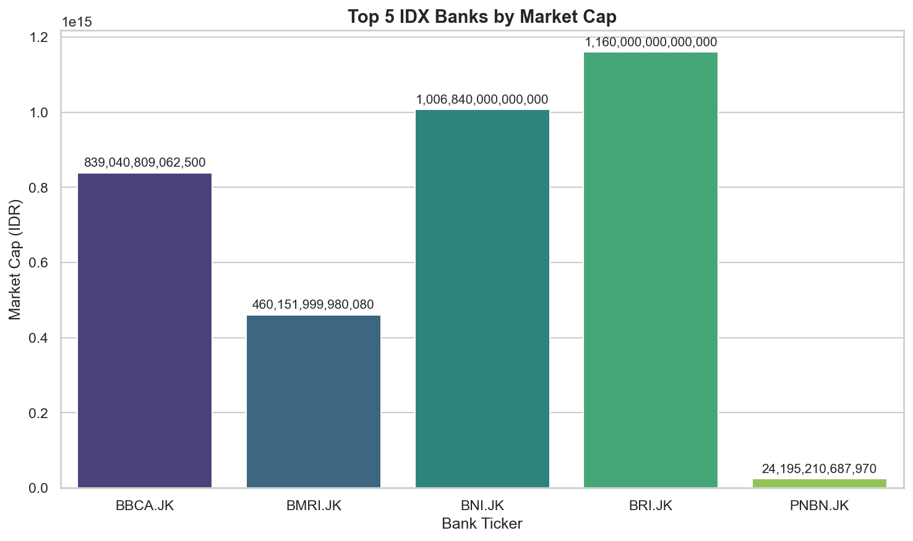

import {TOC} from '/snippets/generative-ai-toc.mdx';

<TOC step={3} />

## Overview

In the [previous chapter on Tool Use](./02-tool-use), we built a RAG system where a single AI agent learned to intelligently select and call multiple tools to answer financial queries. We saw how powerful this approach is—our agent could retrieve company data, analyze stock performance, and compare metrics all within one workflow. (If you've also explored our [Agent Skills Guide](./01-agent-skills-guide), you'll recognize this pattern of giving agents access to Sectors Financial API tools.)

But what happens when a task is too complex for a single agent to handle reliably? As queries become more complex or require multiple reasoning steps, even a well-designed single agent can struggle with reliability and accuracy.

This is where **multi-agent workflows** come in. Instead of relying on one agent to juggle multiple responsibilities, we can decompose complex tasks into specialized sub-agents, each focused on doing one thing exceptionally well. Think of it as moving from a solo performer to an orchestra—each instrument (agent) plays its part, and together they create something more robust and reliable than any single performer could achieve alone. 

In this recipe, we'll build on the tool-calling concepts from Chapter 2 and take them further by creating a **Multi-Agent Workflow** using the [OpenAI Agents SDK](https://pypi.org/project/openai-agents/) and the Sectors API. We'll design a robust IDX research assistant using two powerful agentic patterns:
1. **Sequential Chain:** Passing the output of one specialized agent (a screener) to another (a researcher).
2. **Judge and Critic:** Using a third agent (an evaluator) to rigorously grade the output and demand revisions if it falls short.

## Prerequisites

This recipe assumes you are familiar with generating an API key and completing a basic request. If you haven't already, review these two recipes:
* [Your First Request!](../quick-start-in-python/00-your-first-request)
* [Agent Skills Guide](./01-agent-skills-guide)

You will need the `openai-agents` package for this recipe:

```bash
pip install openai-agents 
```

## Step 1: Define the Tools

First, we will wrap two Sectors API endpoints into Python tools: a flexible stock screener and a company overview retrieval tool.

```python
import os
import json
import requests
import asyncio
from typing import Literal
from dataclasses import dataclass
from agents import Agent, Runner, function_tool
from dotenv import load_dotenv()

load_dotenv()

API_KEYS = os.getenv("SECTORS_API_KEY")
os.environ["OPENAI_API_KEY"] = os.getenv("OPENAI_API_KEY")

HEADERS = {"Authorization": API_KEYS}

@function_tool
def find_companies_screener(order_by: str, limit: int, where: str = "") -> str:
    """Screen and rank IDX companies via Sectors v2 API"""
    # URL-encode to handle special chars in filter expressions like >, <, etc
    params = [f"order_by={requests.utils.quote(order_by)}", f"limit={limit}"]
    if where:
        params.insert(0, f"where={requests.utils.quote(where.strip())}")
    
    url = f"https://api.sectors.app/v2/companies/?" + "&".join(params) 
    response = requests.get(url, headers=HEADERS)
    return json.dumps(response.json())

@function_tool
def get_company_overview(ticker: str) -> str:
    """Get company overview and financials for an IDX ticker"""
    url = f"https://api.sectors.app/v2/company/report/{ticker}/?sections=overview,financials"
    response = requests.get(url, headers=HEADERS)
    return json.dumps(response.json())
```

## Step 2: Create the Agents

Instead of using one massive prompt, we create three distinct agents with narrow, specialized responsibilities. This vastly reduces hallucinations and improves accuracy.

```python
screener_agent = Agent(
    name="IDX Screener",
    instructions=(
        "You screen the Indonesia Stock Exchange (IDX) by calling the appropriate tool. "
        "Return ONLY a Python list of clean ticker symbols without the .JK suffix. "
        "Example: ['BBCA', 'BBRI', 'TLKM']"
    ),
    tools=[find_companies_screener],
    model="gpt-4o-mini"
)

researcher_agent = Agent(
    name="IDX Researcher",
    instructions=(
        "You are a financial researcher. You receive a user query and a list of IDX tickers. "
        "Call get_company_overview for every ticker to gather data. "
        "Return ONLY a raw JSON object containing 'metric_fields' and a 'results' array. "
        "Do not use markdown fences."
    ),
    tools=[get_company_overview],
    model="gpt-4o"
)

@dataclass
class EvaluationFeedback:
    feedback: str
    score: Literal["pass", "expect_improvement", "fail"]

evaluator_agent = Agent(
    name="Evaluator",
    instructions=(
        "Grade the provided JSON object. Check that: "
        "1. Every result has a 'ticker' and 'company_name'. "
        "2. The metric fields contain non-null numeric values. "
        "Score 'pass' if all checks pass, otherwise 'expect_improvement' or 'fail'."
    ),
    model="gpt-4o-mini",
    output_type=EvaluationFeedback
)
```

## Step 3: Orchestrate the Workflow

Now we bring it all together. We run the Screener to get tickers and pass those to the Researcher. 
To ensure quality, we use a `for` loop to let the Evaluator critique the Researcher's output. If the output fails, the Researcher is prompted to fix it dynamically.

```python
async def main():
    query = "Top 5 IDX banks by market cap"
    
    # Run the screener
    screener_resp = await Runner.run(screener_agent, query)
    tickers = screener_resp.final_output
    print(f"Tickers found: {tickers}")

    # Initial data gathering
    research_input = f"User query: '{query}'\nTickers: {tickers}"
    research_resp = await Runner.run(researcher_agent, research_input)
    current_draft = research_resp.final_output

    # Evaluate and iterate
    final_output = None
    max_attempts = 3

    for attempt in range(1, max_attempts + 1):
        print(f"Evaluating draft (Attempt {attempt}/{max_attempts})...")
        eval_resp = await Runner.run(evaluator_agent, current_draft)
        
        # Cast the raw output into our structured EvaluationFeedback dataclass
        feedback_obj = eval_resp.final_output_as(EvaluationFeedback)
        
        if feedback_obj.score == "pass":
            final_output = current_draft
            break
        
        print(f"Revision needed. Feedback: {feedback_obj.feedback}")
        revision_input = (
            f"User query: '{query}'\nTickers: {tickers}\n"
            f"Previous output graded '{feedback_obj.score}'.\n"
            f"Feedback: {feedback_obj.feedback}\n"
            "Fix the issues and return the corrected JSON object."
        )
        research_resp = await Runner.run(researcher_agent, revision_input)
        current_draft = research_resp.final_output

    # Use the last draft even if it never passed evaluation
    if not final_output:
        final_output = current_draft

    print("Final Output:")
    print(final_output)

if __name__ == "__main__":
    asyncio.run(main())
```

### Output

When you run the workflow with the query "Top 5 IDX banks by market cap", here's what you'll see in the console:

#### 1. Screener Agent Output

```python
screener_resp = await Runner.run(screener_agent, query)
tickers = screener_resp.final_output
print(f"Tickers found: {tickers}")
```

**Output:**
```
Tickers found: ['BBCA', 'BBRI', 'BMRI', 'BBNI', 'BRIS']
```
The screener agent successfully retrieved the top 5 banking stocks by market capitalization from the IDX.

#### 2. Researcher Agent - Initial Draft

```python
for attempt in range(1, max_attempts + 1):
    print(f"Evaluating draft (Attempt {attempt}/{max_attempts})...")
    eval_resp = await Runner.run(evaluator_agent, current_draft)
```

**Output:**
```
Evaluating draft (Attempt 1/3)...
```
The researcher agent calls `get_company_overview` for each ticker and compiles the data into a structured JSON format.

#### 3. Evaluator Agent - Quality Check

**If the draft passes:**

```python
if feedback_obj.score == "pass":
    final_output = current_draft
    break

# ...later...
print("Final Output:")
print(final_output)
```

**Output:**
```
Final Output:
{
  "metric_fields": ["ticker", "company_name", "market_cap", "listing_date", "sector"],
  "results": [
    {
      "ticker": "BBCA",
      "company_name": "PT Bank Central Asia Tbk.",
      "market_cap": 1263500995330048,
      "listing_date": "2000-05-31",
      "sector": "Financials"
    },
    {
      "ticker": "BBRI",
      "company_name": "PT Bank Rakyat Indonesia Tbk.",
      "market_cap": 923456789012345,
      "listing_date": "2003-11-10",
      "sector": "Financials"
    },
    ...
  ]
}
```

**If revision is needed:**

```python
print(f"Revision needed. Feedback: {feedback_obj.feedback}")
revision_input = (
    f"User query: '{query}'\nTickers: {tickers}\n"
    f"Previous output graded '{feedback_obj.score}'.\n"
    f"Feedback: {feedback_obj.feedback}\n"
    "Fix the issues and return the corrected JSON object."
)
research_resp = await Runner.run(researcher_agent, revision_input)
```

**Output:**
```
Evaluating draft (Attempt 1/3)...
Revision needed. Feedback: Missing 'company_name' field in result index 2. Please ensure all results include ticker and company_name.

Evaluating draft (Attempt 2/3)...
Final Output:
{
  "metric_fields": ["ticker", "company_name", "market_cap"],
  "results": [...]
}
```

The evaluator ensures data quality by checking that every result has required fields with valid values. If it finds issues, it sends the draft back to the researcher with specific feedback for correction.

## Step 4: Visualizing the Results

Once your multi-agent workflow produces structured JSON output, you can create **visualizations** for better insights using standard data science tools like pandas, matplotlib, and seaborn. Because our agents are designed to output clean, structured data, the transition from agent output to visualization is seamless—no manual data wrangling required.

### 1. Install Visualization Dependencies

```bash
pip install pandas matplotlib seaborn
```

### 2. Create Visualization Helper Functions

```python
import matplotlib.pyplot as plt
import seaborn as sns
import pandas as pd

def display_summary_table(data_json):
    """Display a summary table from JSON data"""
    data = json.loads(data_json) if isinstance(data_json, str) else data_json
    df = pd.DataFrame(data['results'])

    # Format market cap in billions for readability
    if 'market_cap' in df.columns:
        df['market_cap_billions'] = (df['market_cap'] / 1_000_000_000).round(2)

    print("\n" + "="*80)
    print("Company Analysis Summary")
    print("="*80)
    print(df.to_string(index=False))
    print("="*80 + "\n")

def create_bar_chart(data_json, title="Market Cap Comparison", x_col='ticker', y_col='market_cap'):
    """Create and display a bar chart"""
    data = json.loads(data_json) if isinstance(data_json, str) else data_json
    df = pd.DataFrame(data['results'])

    plt.figure(figsize=(10, 6))
    sns.set_theme(style="whitegrid")

    x_data = df[x_col] if x_col in df.columns else df.index
    y_data = df[y_col]

    ax = sns.barplot(x=x_data, y=y_data, palette='viridis', hue=x_data, legend=False)
    ax.set_title(title, fontweight='bold', fontsize=14)
    ax.set_xlabel('Bank Ticker', fontsize=12)
    ax.set_ylabel('Market Cap (IDR)', fontsize=12)

    # Add value labels on bars
    for i, v in enumerate(y_data):
        ax.text(i, v + max(y_data) * 0.01, f'{v/1e12:.2f}T',
               ha='center', va='bottom', fontsize=10)

    plt.tight_layout()
    plt.show()

print("Visualization functions defined")
```

### 3. Visualize Your Agent's Output

After running your multi-agent workflow and obtaining `final_output`, run the codes below:

```python
# Display bar chart
create_bar_chart(final_output, title="Top 5 IDX Banks by Market Cap")
```

**Output:**



```python
# Display summary table
display_summary_table(final_output)
```

**Output:**

```
================================================================================
Company Analysis Summary
================================================================================
ticker       market_cap  company_name                    eps    market_cap_billions
BBCA   839040809062500  PT Bank Central Asia Tbk.      471.45           839040.81
BMRI   460151999980080  PT Bank Mandiri (Persero) Tbk  609.24           460152.00
BNGA    43932233378760  PT Bank CIMB Niaga Tbk         277.17            43932.23
PNBN    24195210687970  Bank Pan Indonesia Tbk         114.87            24195.21
BSIM    17468540048590  Bank Sinarmas Tbk               14.90            17468.54
================================================================================
```

These visualization functions help you quickly understand the data returned by your agents without manually parsing JSON. Because the agents produce standardized output, transitioning from AI-generated insights to data analysis tools is effortless. You can easily extend these functions to create other types of charts (line charts, scatter plots, etc.) or customize the styling to match your presentation needs.

## Summary

In this chapter, we advanced beyond single-agent RAG systems to build a robust **multi-agent workflow** that demonstrates two powerful agentic patterns:

1. **Sequential Chain Pattern**: We created specialized agents that work in sequence—a Screener agent retrieves relevant tickers, then passes them to a Researcher agent that gathers detailed company data. Each agent has a narrow, well-defined responsibility, reducing complexity and improving reliability.

2. **Judge-Critic Pattern**: We implemented an Evaluator agent that rigorously validates the Researcher's output against strict quality criteria. If issues are detected, the evaluator provides specific feedback and the researcher revises its output—implementing a self-improving loop that dramatically increases output quality.

By designing agents to produce structured JSON output, we've created a system that integrates seamlessly with standard data science tools. The final output can be:
- Visualized with pandas, matplotlib, and seaborn for exploratory analysis
- Stored in databases for historical tracking
- Fed into dashboards for real-time monitoring
- Used as input for other AI systems or business logic