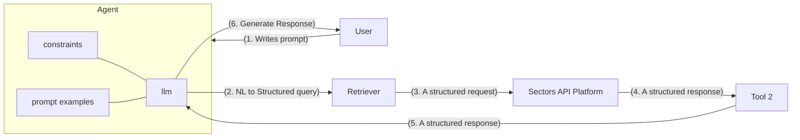
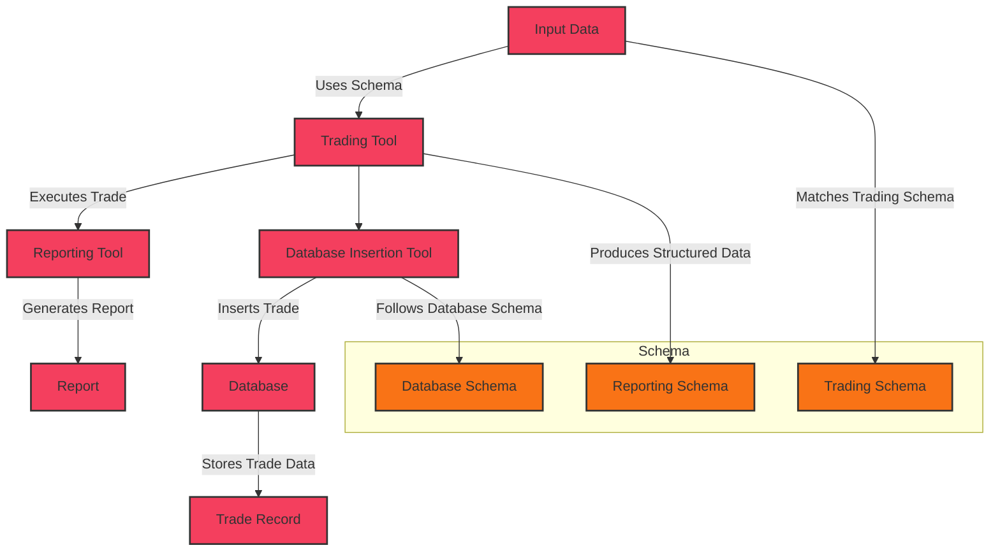

<Note>
    This article is part 3 of the Generative AI for Finance series, and is written using LangChain 0.3.0 (released on 14th September 2024). 
    
    For best results, it is recommended to consume the series in order, starting from [chapter 1](/recipes/generative-ai-python/01-background).
    
    For continuity purposes, I will point out the key differences between the current version (featuring `ReAct-style agent) and the older implementations featuring `AgentExecutor` (in [chapter 1](/recipes/generative-ai-python/01-background) and [chapter 2](/recipes/generative-ai-python/02-tool-use)).
</Note>

## Schema-aware RAG Systems
We've learned in previous chapters how language models on their own are incapable of performing any action beyond generating text. Thus, the core innovation is the introduction of agents -- specifically Agentic RAG systems. 

We equip the agents with tools, pick a language model that is fine-tuned for tool use, and orchestrate the interaction between the user, the language model, and the tools. This allows the language model to call upon tools to perform actions and retrieve data, and then use that data to generate a response, as we [have seen in the previous chapter](02-tool-use.mdx).

Since this system require the language model to interact with external data sources, we might need to introduce some schema to the output of our tools. The schema constrains the output of each tool to a specific format, making it possible for a downstream tool to understand and process the output of an upstream tool. At the furthest end of the chain, the language model can then use the structured output to generate a response to the user's query, optionally conforming to a predefined structure or schema if so desired. 



In the diagram above, we observe that:

1. In (2) and (3), the language model converts the user's natural language query into a structured query that can be understood by the retriever. This retrievel is implemented as a tool in our RAG (Retrieval-Augmented Generation) system, with its primary focus on retrieving data from an external data source or knowledge base. In our case, it's the Sectors Financial API. API services like Sectors provide a structured interface for querying financial data, and typically but not always, return data in a structured format like JSON.

2. In (4), this structured response is then passed to the downstream tool, which can be another tool in the RAG system that performs additional actions such as translation, summarization, or analysis on the retrieved data. A constraint can be imposed on the output of the retriever to ensure that the downstream tool can understand and process the data correctly, and predictably.

3. In (5), the downstream tool in turn generates a structured response that is passed back to the language model. This structured response can be used by the language model to generate a response to the user's query. For example, in the context of a robo-advisor, this response must contain a Python list of stock symbols and their corresponding prices, or a dictionary of stock symbols and their corresponding market caps.

In code, these constraints might be implemented through `typing` annotations in Python. For example, the `get_top_companies_by_tx_volume` tool might have the following signature:

```python
from typing import List, Dict

def get_top_companies_by_tx_volume(
    start_date: str, end_date: str, top_n: int = 5
) -> List[Dict[str, str]]:
    """
    Get top companies by transaction volume
    """
    ...
```

If you take the above examples further, our tool might even implement some automated trading strategies, where the output of the tool is used in a downstream tool to place bids and offers on the stock market. When a trade is executed, another tool might be used to generate a report on the trade, or insert the trade into a database for record-keeping purposes.

In both of these scenarios, a specific schema is not only helpful but necessary to ensure that the output of each tool matches the input requirements of:
- (1) the trading tool that places the bid or offer, and
- (2) the reporting tool that generates a report from structured data
- (3) the database insertion tool that inserts the trade into a database following a specific schema




## Implementing Schema Constraints to AI Agents
For the Challenge in this chapter, we are going to build an AI agent that can (1) extract information from unstructured 
text, (2) run validation checks on the extracted data based on schema constraints and business logic rules, and (3) generate a structured response ready 
for downstream tools to process.

This has many practical applications. You can imagine an assistant chatbot that extract information from loose text such as news, 
press releases, or even user's conversational queries, and then generate structured responses to be fed into a downstream tool. One might 
also imagine a chatbot that allow user to upload a document, extract information, and then perform some actions based on the extracted data.

### Structured AI w/ Pydantic
Let's begin with a simple Python class, `Stock`, that represents a stock and its attributes. We are inheriting from `BaseModel` of the `pydantic` library, a popular data validation library in Python.

```python
from typing import Optional
from pydantic import BaseModel, Field

class Stock(BaseModel):
    """Information about a company's stock"""

    symbol: str = Field(description="The stock symbol")
    name: str = Field(description="The name of the company for which the stock symbol represents")
    sector: Optional[str] = Field(default=None, description="The sector of the company")
    industry: Optional[str] = Field(default=None, description="The industry of the company")
    market_cap: Optional[int] = Field(default=None, description="The market capitalization of the company")
```

Supposed we want our large language model to generate a response that always generate an output adhering to the schema of our `Stock` class, we can count on `pydantic` to validate the output of our tools and call the `.with_structured_output()` on the LLM to obtain structured outputs. 

The `.with_structured_output()` method always takes a schema as input, respecting the names, types and descriptions of the fields, or attributes, of the schema. It then returns objects that conform to the schema (instead of strings), which can be used in downstream tools when orchestrated in a chain-like fashion.

When using Pydantic, the model-generated output will be validated against the schema, with Pydantic raising an error if the output does not match the schema (e.g. required fields missing, or fields of the wrong type). Below is an example of creating a structured LLM with Pydantic. I'm choosing to use the `llama3-groq-70b-8192-tool-use-preview` model from Groq, which is fine-tuned for tool use. 

```python
import os
from dotenv import load_dotenv
from typing import Optional

from pydantic import BaseModel, Field

from langchain_groq import ChatGroq

load_dotenv()
GROQ_API_KEY = os.getenv("GROQ_API_KEY")

class Stock(BaseModel): 
    """Information about a company's stock"""

    symbol: str = Field(description="The stock symbol")
    name: str = Field(description="The name of the company for which the stock symbol represents")
    sector: Optional[str] = Field(default=None, description="The sector of the company")
    industry: Optional[str] = Field(default=None, description="The industry of the company")
    market_cap: Optional[int] = Field(default=None, description="The market capitalization of the company")


llm = ChatGroq(
    temperature=0,
    model_name="llama3-groq-70b-8192-tool-use-preview",
    groq_api_key=GROQ_API_KEY,
)

structured_llm = llm.with_structured_output(Stock)
print(type(structured_llm))

# output:
# <class 'langchain_core.runnables.base.RunnableSequence'>
```

<Tip>
    The name of the Pydantic class, the docstring, the names of the fields, and the descriptions of the fields are all **very important**. `with_structured_output` is most commonly used in tool-use scenarios (i.e. function-calling, or tool-calling) and these 
    information essentially act as model prompts to guide the language model in generating structured outputs.
</Tip>

Let's use this structured LLM to retrieve information from unstructured text, and see how it generates structured outputs that conform to the schema of the `Stock` class.

```python
text = """
    Bank Central Asia (BCA) is a bank in Indonesia and is part of the finance sector.
    It is in the banking industry and has a market capitalization of $85 billion.
    It trades under the symbol BBCA on the Indonesia Stock Exchange.
    """
out = structured_llm.invoke(text)
print(out)
# Stock(symbol='BBCA', name='Bank Central Asia', sector='finance', industry='banking', market_cap=85000000000)
```

In the case of extracting structured data from unstructured text, the language model is able to generate structured outputs that conform to the schema of the `Stock` class. One can imagine a common use case being a chatbot that can extract information about companies from news articles, press releases, PDF documents or other unstructured text sources into a structured format adhering to the schema of the `Stock` class ready for database insertion.

We can similarly use the LLM to generate structured outputs from natural language prompts. We specify our instructions, and the structured LLM will respect the schema of the `Stock` class when generating the output.

```python
create = "Create a fictitious company called Supertype Inc. that is in the technology sector and has a market capitalization of $10 million. It trades under the symbol SUPA."
generated = structured_llm.invoke(create)
print(generated)
# Stock(symbol='SUPA', name='Supertype Inc.', sector='technology', industry=None, market_cap=10000000)
```

### LangChain Expression Language (LCEL) 
We're making a small detour to introduce LangChain's new syntax for creating chains through composition. Directly from the Announcement:

> Chaining can mean making multiple LLM calls in a sequence. Language models are often non deterministic and can make errors, so making multiple calls to check previous outputs or to break down larger tasks into bite-sized steps can improve results.
>
> **Constructing the Input to LLMs**
> 
> Chaining can mean combining data transformation with a call to an LLM. For example, formatting a prompt template with user input or using retrieval to look up additional information to insert into the prompt template
> Using the Output of LLMs
> 
> Another form of chaining refers to passing the output of an LLM call to a downstream application. For example, using the LLM to generate Python code and then running that code; using the LLM to generate SQL and then executing that against a SQL database.

The essential functionalities are:
- `|` (pipe) operator to chain multiple functions together
- `.invoke()` to call the LLM
- `.batch()` to run the chain against a list of inputs
- `.stream()` to return an iterable 

Consider the following example:

```python
from langchain.chat_models import ChatOpenAI
from langchain.prompts import ChatPromptTemplate

model = ChatOpenAI() # use any LLM model here
prompt = ChatPromptTemplate.from_template("give me information for the stock: {symbol}")
chain = prompt | model

chain.invoke({"symbol": "BBCA"})
# output:
#  {"symbol": "BBCA.JK", "company_name": "PT Bank Central Asia Tbk.", "overview": {"listing_board": "Main", "industry": "Banks", "sub_industry": "Banks", "sector": "Financials", "sub_sector": "Banks", "market_cap": 1303633169743872, "market_cap_rank": 1, "address": "Menara BCA, Grand Indonesia\r\nJalan MH Thamrin No. 1\r\nJakarta 10310", "employee_num": 27547, "listing_date": "2000-05-31", "website": "www.bca.co.id", "phone": "021-23588000", "email": "investor_relations@bca.co.id", "last_close_price": 10700, "latest_close_date": "2024-09-26", "daily_close_change": -0.0138248847926267}}
```

`.batch()` takes a list of inputs and will perform optimizations such as batching calls to LLM providers when possible.

```python
chain.batch([{"symbol": "BBCA"}, {"symbol": "BBRI"}])
```

`.stream()` returns an iterable:
```python
for s in chain.stream({"symbol": "BMRI"}):
    print(s.content, end="")
```

### Structured AI w/ Multiple Schemas
We're going to make some slight improvements to our AI agent by:
- Creating a new schema, `Stocks` that represents a list of `Stock` objects
- Creating a new schema, `ConversationalResponse` that represents a response to a conversational query (e.g "how are you?", "what's your name?")
- Combine these schemas to a new schema, called `FinalResponse` that represents the final response of our AI agent
- Just to demonstrate the use of LCEL, we'll create a `prompt` object and use the chaining syntax to construct our `RunnableSequence`

Here are the additions:

```python
class Stocks(BaseModel):
    """Extrated data about stocks"""

    stocks:List[Stock] 

class ConversationalResponse(BaseModel):
    """Respond in a conversation manner. Be nice and sweet."""
    response: str = Field(description="A helpful response to the user's query")

class FinalResponse(BaseModel):
    """Final response to the user's query"""
    output: Union[Stocks, ConversationalResponse]

prompt = ChatPromptTemplate.from_messages(
    [
        (
            "system",
            "You are an expert extraction algorithm, "
            "Extract relevant information from the text. "
            "If you do not know the value of an attribute asked to extract, "
            "return null for the attribute's value.",
        ),
        ("human", "{text}"),
    ]
)

runnable = prompt | llm.with_structured_output(schema=FinalResponse)
```

Notice the introduction of a `FinalResponse` schema that can either contain a list of `Stock` objects or a `ConversationalResponse` object. This is a common pattern in AI systems where the output can be of different types depending on the context of the query.

Pay attention to the use of `|` operator as well. This is the chaining syntax that allows us to compose multiple functions together, composing the final chain ("runnable sequence") that can be executed by calling `.invoke()`.

In fact, let's now call `.invoke()` to run the chain and see how the AI agent generates structured outputs with our new schemas:

```python
text = """
    Bank Central Asia (BCA) is a bank in Indonesia and is part of the finance sector.
    It is in the banking industry and has a market capitalization of $85 billion.
    It trades under the symbol BBCA on the Indonesia Stock Exchange.
    
    Bank Rakyat Indonesia (BRI) is the oldest bank in Indonesia, tracing back since 1895. It 
    has a market capital of $52 billion and is an important player in the country's finance sector. It 
    trades as BBRI on the Indonesia Stock Exchange.
    """

out = runnable.invoke({"text": text})
# in FinalResponse schema, the return value is stored in an attribute called `output`
out_list = list(out.output.stocks)

print(out_list[0])
# Stock(symbol='BBCA', name='Bank Central Asia', sector='finance', industry='banking', market_cap=85000000000)

print(out_list[1])
# Stock(symbol='BBRI', name='Bank Rakyat Indonesia', sector='finance', industry='banking', market_cap=52000000000)
```

Our chain is now capable of handling a wider range of queries, with the LLM capable of handling all existing use-cases as well as new ones that require a conversational response.

```python
create = "Create two fictional companies that contain the word 'Super' in their name and operating in the technology sector. Make up the other details about the companies."
generated = runnable.invoke(create)
print(generated.output)
# Stocks(stocks=[Stock(symbol='SPR', name='SuperTech Innovations', sector='Technology', industry='Technology', market_cap=500000000), Stock(symbol='SUP', name='SuperNet Solutions', sector='Technology', industry='Technology', market_cap=750000000)])

question = "how are you this evening?"
generic = runnable.invoke(question)
print(generic.output)
# response="I'm doing well, thank you for asking. How can I assist you further this evening?"
```

<Check>
    Large Language models generate text. In times where we want these language models to generate more structured information than just raw text, we use schemas to constrain the output of the model. In the following section, we will see another approach using output parsers that come with LangChain.
</Check>

## Output Parsers
### `PydanticOutputParser`
Consider the `Stock` model that we have created earlier. We will add two `model_validator` as class methods to the `Stock` class, used to validate the output of the model. We will then create a `parser` object which we can include in the downstream of our chain. 

These are the changes we need to make to the `Stock` class:

```python
class Stock(BaseModel): 
    """Information about a company's stock"""

    symbol: str = Field(description="The stock symbol")
    name: str = Field(description="The name of the company for which the stock symbol represents")
    sector: Optional[str] = Field(default=None, description="The sector of the company")
    industry: Optional[str] = Field(default=None, description="The industry of the company")
    market_cap: Optional[int] = Field(default=None, description="The market capitalization of the company")

    @model_validator(mode="before")
    @classmethod
    def validate_symbol_4_letters(cls, values: dict) -> dict:
        symbol = values["symbol"]
        
        if len(symbol) != 4:
            raise ValueError("Symbol must be 4 letters long")
        return values

    @model_validator(mode="before")
    @classmethod
    def validate_market_cap(cls, values: dict) -> dict:
        market_cap = values["market_cap"]
        
        if market_cap < 0:
            raise ValueError("Market cap must be a positive number")
        return values   
```

And we'll also create the `parser` object:

```python
parser = PydanticOutputParser(pydantic_object=Stock)
```

Let us execute `get_format_instructions` to see what the output generated for us by `PydanticOutputParser` looks like:

```bash
>>> parser.get_format_instructions()
'The output should be formatted as a JSON instance that conforms to the JSON schema below.\n\nAs an example, for the schema {"properties": {"foo": {"title": "Foo", "description": "a list of strings", "type": "array", "items": {"type": "string"}}}, "required": ["foo"]}\nthe object {"foo": ["bar", "baz"]} is a well-formatted instance of the schema. The object {"properties": {"foo": ["bar", "baz"]}} is not well-formatted.\n\nHere is the output schema:\n```\n{"description": "Information about a company\'s stock", "properties": {"symbol": {"description": "The stock symbol", "title": "Symbol", "type": "string"}, "name": {"description": "The name of the company for which the stock symbol represents", "title": "Name", "type": "string"}, "sector": {"anyOf": [{"type": "string"}, {"type": "null"}], "default": null, "description": "The sector of the company", "title": "Sector"}, "industry": {"anyOf": [{"type": "string"}, {"type": "null"}], "default": null, "description": "The industry of the company", "title": "Industry"}, "market_cap": {"anyOf": [{"type": "integer"}, {"type": "null"}], "default": null, "description": "The market capitalization of the company", "title": "Market Cap"}}, "required": ["symbol", "name"]}\n```'
```

We observe that this method only returns a string containing instructions for how the output should be formatted. If we had so desired, this could be an instruction string that we write out from scratch.

We will now use `PromptTemplate` to create a prompt and chain it with our LLM and the `parser` object:

```python
prompt = PromptTemplate(
    template="Answer the user query.\n{format_instructions}\n{query}\n",
    input_variables=["query"],
    partial_variables={"format_instructions": parser.get_format_instructions()},
)

runnable = prompt | llm | parser
# execute with runnable.invoke("...")
```

The final line, `prompt | llm | parser` uses LCEL syntax and `runnable.invoke()` is equivalent to:

```python
prompt_and_llm = prompt | llm
output = prompt_and_llm.invoke("...")
parser.invoke(output)
```

Invoking the chain (regardless of which syntax you use) will return a structured output that conforms to the schema of the `Stock` class.

```python
create = "Create a fictional company that contain the word 'Super' in their name and operating in the technology sector. Make up the other details about the company."
generated = runnable.invoke(create)
print(generated)
# output:
# Stock(symbol='SUPR', name='SuperTech', sector='Technology', industry='Software', market_cap=5000000000)
```

Not only does the `PydanticOutputParser` validate the output of the model, it also provides instructions on how the output should be formatted and uses `model_validator` to ensure that the output meets our expectations and conforms to the schema of the `Stock` class.

In the optional exercises below, you will be tasked with writing a test for the `PydanticOutputParser` to ensure that it raises a `ValueError` when the market capitalization is negative.

### `SimpleJsonOutputParser`
In this section, we will take a look at the `SimpleJsonOutputParser` which is a simpler output parser that does not use Pydantic. It is useful when you do not need to validate the output of the model against a schema, but still want to generate structured outputs in JSON format.

```python
class Stock(BaseModel): 
    ...

class Data(BaseModel):
    """Extrated data about stocks"""

    stocks:List[Stock] 
    followup_question: Optional[str] = Field(default=None, description="A follow-up question to ask the user")   

llm = ChatGroq(
    temperature=0,
    model_name="llama3-groq-70b-8192-tool-use-preview",
    groq_api_key=GROQ_API_KEY,
    model_kwargs={ "response_format": { "type": "json_object" } },
)
```
The `Stock` and `Data` classes are the same as before, but we have added a `followup_question` field to the `Data` class. We will use this field to ask the user a follow-up question after extracting the data about the stocks. 

<Tip>
JSON-mode is [not supported by all LLM models](https://python.langchain.com/docs/integrations/chat/#advanced-features), but when it is, it allows the model to return a JSON object instead of a string. This is useful when you want to generate structured outputs in JSON format.
</Tip>

The other steps are largely the same as before. We alter the `PromptTemplate` to include the `followup_question` field with some additional instructions, then chain the `PromptTemplate`, the LLM, and the `SimpleJsonOutputParser` together.

```python
# switch out: 
# from langchain_core.output_parsers import PydanticOutputParser
# replace with:
from langchain.output_parsers.json import SimpleJsonOutputParser

prompt = PromptTemplate.from_template(
   """
   Extract relevant information from the text. For the followup_question key, generate a follow-up question to ask the user,
   Return a JSON object with the keys 'stocks' and 'followup_question' satisfying the user query: {text}
   """
)

runnable = prompt | llm | SimpleJsonOutputParser()
```

The output of the model is now a JSON object that conforms to the schema of the `Data` class. The `SimpleJsonOutputParser` does not validate the output of the model against a schema, but it does generate structured outputs in JSON format.

```python
text = """
    Bank Central Asia (BCA) is a bank in Indonesia and is part of the finance sector.
    It is in the banking industry and has a market capitalization of $85 billion.
    It trades under the symbol BBCA on the Indonesia Stock Exchange.
    
    Bank Rakyat Indonesia (BRI) is ...
    """

# assuming 'text' and 'create' are defined as before
out = runnable.invoke({"text": text})
print(out.keys()) 
# dict_keys(['stocks', 'followup_question'])

print(out)
# {'stocks': [{'name': 'Bank Central Asia', 'symbol': 'BBCA', 'market_capitalization': '$85 billion', 'industry': 'banking', 'sector': 'finance'}, {'name': 'Bank Rakyat Indonesia', 'symbol': 'BBRI', 'market_capitalization': '$52 billion', 'industry': 'banking', 'sector': 'finance'}], 'followup_question': 'Would you like more detailed information on any of these banks?'}
```
Sure enough, the `out.keys()` call returns a dictionary with the keys `stocks` and `followup_question`, with the extration to structured data matching the schema of the `Data` class.

A caveat with this approach is that the `SimpleJsonOutputParser`, as mentioned above, **does not validate the output of the model against a schema**, so this is a task that you will have to perform manually (better prompts, few-shot prompting, or any useful techniques) perhaps implemented as a downstream tool. This is especially important if you are generating structured outputs with a strict schema that you want to enforce.

```python
create = "Create 2 fictitious companies that contain the word 'Super' in their company name and operate in the Technology sector. Make up the other details about the company."
generated = runnable.invoke(create)
print(generated)

# {'stocks': [{'company_name': 'SuperTech Innovations', 'industry': 'Technology', 'location': 'Silicon Valley, California', 'product': 'Advanced AI systems'}, {'company_name': 'SuperNet Solutions', 'industry': 'Technology', 'location': 'Bangalore, India', 'product': 'High-speed internet services'}], 'followup_question': 'Would you like more information on any of these companies?'}
```

Notice that the generative output contains a list of two companies with the attributes `company_name`, `industry`, `location`, and `product`, which, while structured, are not validated against our schema.

### Putting it together


<CodeGroup>

```python PydanticOutputParser
import os
from dotenv import load_dotenv
from typing import Optional

from pydantic import BaseModel, Field, model_validator

from langchain_openai import OpenAI
from langchain_core.output_parsers import PydanticOutputParser
from langchain_core.prompts import PromptTemplate

load_dotenv()
SECTORS_API_KEY = os.getenv("SECTORS_API_KEY")
OPENAI_API_KEY = os.getenv("OPENAI_API_KEY")

llm = OpenAI(model_name="gpt-3.5-turbo-instruct", temperature=0.0)

class Stock(BaseModel): 
    """Information about a company's stock"""

    symbol: str = Field(description="The stock symbol")
    name: str = Field(description="The name of the company for which the stock symbol represents")
    sector: Optional[str] = Field(default=None, description="The sector of the company")
    industry: Optional[str] = Field(default=None, description="The industry of the company")
    market_cap: Optional[int] = Field(default=None, description="The market capitalization of the company")

    @model_validator(mode="before")
    @classmethod
    def validate_symbol_4_letters(cls, values: dict) -> dict:
        symbol = values["symbol"]
        
        if len(symbol) != 4:
            raise ValueError("Symbol must be 4 letters long")
        return values

    @model_validator(mode="before")
    @classmethod
    def validate_market_cap(cls, values: dict) -> dict:
        market_cap = values["market_cap"]
        
        if market_cap < 0:
            raise ValueError("Market cap must be a positive number")
        return values   

parser = PydanticOutputParser(pydantic_object=Stock)

prompt = PromptTemplate(
    template="Answer the user query.\n{format_instructions}\n{query}\n",
    input_variables=["query"],
    partial_variables={"format_instructions": parser.get_format_instructions()},
)

runnable = prompt | llm | parser

create = "Create a fictional company that contain the word 'Super' in their name and operating in the technology sector. Make up the other details about the company."
generated = runnable.invoke(create)
```

```python SimpleJsonOutputParser
import os
from dotenv import load_dotenv
from typing import Optional, List

from pydantic import BaseModel, Field

from langchain_core.prompts import PromptTemplate
from langchain_groq import ChatGroq 
from langchain.output_parsers.json import SimpleJsonOutputParser

load_dotenv()
GROQ_API_KEY = os.getenv("GROQ_API_KEY")
SECTORS_API_KEY = os.getenv("SECTORS_API_KEY")

class Stock(BaseModel): 
    """Information about a company's stock"""

    symbol: str = Field(description="The stock symbol")
    name: str = Field(description="The name of the company for which the stock symbol represents")
    sector: Optional[str] = Field(default=None, description="The sector of the company")
    industry: Optional[str] = Field(default=None, description="The industry of the company")
    market_cap: Optional[int] = Field(default=None, description="The market capitalization of the company")

class Data(BaseModel):
    """Extrated data about stocks"""

    stocks:List[Stock] 
    followup_question: Optional[str] = Field(default=None, description="A follow-up question to ask the user")   

prompt = PromptTemplate.from_template(
   """
   Extract relevant information from the text. For the followup_question key, generate a follow-up question to ask the user,
   Return a JSON object with the keys 'stocks' and 'followup_question' satisfying the user query: {text}
   """
)

llm = ChatGroq(
    temperature=0,
    model_name="llama3-groq-70b-8192-tool-use-preview",
    groq_api_key=GROQ_API_KEY,
    model_kwargs={ "response_format": { "type": "json_object" } },
)

runnable = prompt | llm | SimpleJsonOutputParser()

text = """
    Bank Central Asia (BCA) is a bank in Indonesia and is part of the finance sector.
    It is in the banking industry and has a market capitalization of $85 billion.
    It trades under the symbol BBCA on the Indonesia Stock Exchange.
    
    Bank Rakyat Indonesia (BRI) is the oldest bank in Indonesia, tracing back since 1895. It 
    has a market capital of $52 billion and is an important player in the country's finance sector. It 
    trades as BBRI on the Indonesia Stock Exchange.
    """

out = runnable.invoke({"text": text})

create = "Create 3 fictitious companies that contain the word 'Super' in their company name and operate in the Technology sector. Make up the other details about the company."
generated = runnable.invoke(create)
```
</CodeGroup>

## Challenge

<Card title="Earn a Certificate" horizontal icon="award" href="https://github.com/onlyphantom/llm-python/discussions/39">
 There is an associated challenge with this chapter. Successful completion of this challenge will earn you a certificate
 of completion and possibly extra rewards if you're among the top performers.
</Card>

Write a `test_parser.py` file that tests the extraction of structured data from unstructured text using the `PydanticOutputParser`. 

```python
def test_output_parser_mcap():
    text = """
    Bank Central Asia (BCA) is a bank in Indonesia and is part of the finance sector.
        It is in the banking industry and has a market capitalization of $-8.5 billion.
    """
```

`text` above contains a negative market capitalization value. The test should validate that the `PydanticOutputParser` raises a `ValueError` when the market capitalization is negative, instead of continuing with the parsing and feed this output into a downstream tool (i.e. report creation tool, database insertion tool etc).

1. Use either `unittest` or `pytest` to write the test. `pytest` needs to be installed with `pip install pytest` if you choose the latter (`unittest` is part of the Python standard library).
2. Implement the test in `test_parser.py` and run it using `pytest test_parser.py` or `python -m unittest test_parser.py`.

<Card icon="video" title="Learn: Writing Python Unit Test" href="https://youtu.be/wKasoP5bKJk?si=9F_O2pn1INcPiI8v">
    If you are new to writing Python unit tests, you can watch this video to get an overview of how to write unit tests in Python.   
</Card>

Use the provided Google Colab template to submit your answer, showing all output from every cell. You may share the link to your Google Colab 
in the [discussion thread](https://github.com/onlyphantom/llm-python/discussions/39) for grading and feedback.


 
