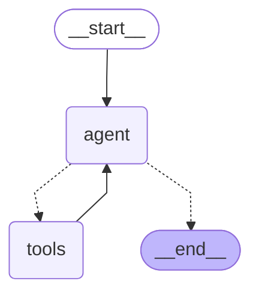

<Note>
    This article is part 4 of the Generative AI for Finance series, and is written using LangChain 0.3.0 (released on 14th September 2024). 
    
    For best results, it is recommended to consume the series in order, starting from [chapter 1](/recipes/generative-ai-python/01-background).
    
    For continuity purposes, I will point out the key differences between the current version (featuring `ReAct-style agent) and the older implementations featuring `AgentExecutor` (in [chapter 1](/recipes/generative-ai-python/01-background) and [chapter 2](/recipes/generative-ai-python/02-tool-use)).
</Note>

## Tool Use LangGraph Agents
Part 4 of this series will feel familiar to readers who have gone through the materials in [chapter 2](/recipes/generative-ai-python/02-tool-use), with the addition of the `LangGraph` library and 
a prebuilt ReAct agent that comes with LangGraph.

To make use of the `LangGraph` library, you will need to install it:

```bash
pip install langgraph
```

LangGraph is a library by LangChain, intended for more complex agentic systems and greater control 
than LangChain's agents. The orchestration isn't much different from what you have seen up to 
this point, so let us walk this process through:

1. Setting up our secrets and retriever utility
2. Creating our tools with the `@tool` decorator
3. Use `create_react_agent` to create our agent equipped with tools we created from (2)
4. Using the [LCEL syntax](/recipes/generative-ai-python/03-structured-output) to set up our runnables
5. Invoke the runnables 

### Setting up a retriever utility
The following code should feel familiar to you if you have gone through [chapter 2: tool use LLMs](/recipes/generative-ai-python/02-tool-use).

<CodeGroup>
```python app.py
import os
import json
import requests

from dotenv import load_dotenv
from typing import List

load_dotenv()
GROQ_API_KEY = os.getenv("GROQ_API_KEY")
SECTORS_API_KEY = os.getenv("SECTORS_API_KEY")

def retrieve_from_endpoint(url: str) -> dict:
    headers = {"Authorization": SECTORS_API_KEY}

    try:
        response = requests.get(url, headers=headers)
        response.raise_for_status()
        data = response.json()
    except requests.exceptions.HTTPError as err:
        raise SystemExit(err)
    return json.dumps(data)
```

```txt .env
GROQ_API_KEY="..."
SECTORS_API_KEY="..."
```
</CodeGroup>

With the retriever utility in place, we can proceed to create the various tools that our agent will use.
Our tools are thin wrappers around the retriever utility, designed to fetch data from Sectors Financial API 
based on the user's query.

### Creating information retrieval tools 

```python
from langchain_core.tools import tool

@tool
def get_company_overview(stock: str) -> dict:
    """
    Get company overview
    
    @param stock: The stock symbol of the company
    @return: The company overview
    """

    url = f"https://api.sectors.app/v1/company/report/{stock}/?sections=overview"

    return retrieve_from_endpoint(url)


@tool
def get_top_companies_ranked(dimension: str) -> List[dict]:
    """
    Return a list of top companies (symbol) based on certain dimension (dividend yield, total dividend, revenue, earnings, market cap,...)

    @param dimension: The dimension to rank the companies by, one of: dividend_yield, total_dividend, revenue, earnings, market_cap, ...
    @return: A list of top tickers in a given year based on certain classification
    """

    url = f"https://api.sectors.app/v1/companies/top/?classifications={dimension}"

    return retrieve_from_endpoint(url)
```

With the `@tool` decorator, we turn our functions into LangChain's structured tools, of the type `<class 'langchain_core.tools.structured.StructuredTool'>`, and 
these tools can be used, either directly or indirectly by our agent. 

Just to see how the tools work, let us invoke them directly:

```python
out = get_company_overview.invoke({"stock": "BBRI"})
out2 = get_top_companies_ranked.invoke({"dimension": "dividend_yield"})
print(out)
print(out2)
```

Notice that at this point we are not using the `ReAct` agent yet. In fact, we don't even have a Language Model (neither Llama3.1 nor GPT-4) to work with.
Here is the result of the above code:

```json
{"symbol": "BBRI.JK", "company_name": "PT Bank Rakyat Indonesia (Persero) Tbk", 
"overview": {"listing_board": "Main", 
        "industry": "Banks", 
        "sub_industry": "Banks", 
        "sector": "Financials", 
        "sub_sector": "Banks", 
        "market_cap": 732761686016000, 
        "market_cap_rank": 4, 
        "address": "Gedung BRI I Lantai 20\r\nJl. Jenderal Sudirman Kav.44-46, Jakarta Pusat 10210", 
        "employee_num": 80257, 
        "listing_date": "2003-11-10", 
        "website": "www.bri.co.id", 
        "phone": "021 - 575 1966", 
        "email": "humas@bri.co.id; corsec@bri.co.id", 
        "last_close_price": 4860, 
        "latest_close_date": "2024-10-04", 
        "daily_close_change": -0.0121951219512195}}
```

and: 

```json
{"dividend_yield": 
    [{"symbol": "ITMG.JK", "company_name": "Indo Tambangraya Megah Tbk", "dividend_yield": 0.114533205004812}, 
    {"symbol": "BJBR.JK", "company_name": "Bank Pembangunan Daerah Jawa Barat dan Banten Tbk", "dividend_yield": 0.0984974124888682}, 
    {"symbol": "BJTM.JK", "company_name": "Bank Pembangunan Daerah Jawa Timur Tbk", "dividend_yield": 0.0962654856453955}, 
    {"symbol": "ADMF.JK", "company_name": "Adira Dinamika Multi Finance Tbk", "dividend_yield": 0.0865924276169265}, 
    {"symbol": "MCOL.JK", "company_name": "PT Prima Andalan Mandiri Tbk", "dividend_yield": 0.0771300448430493}]}
```

The output gives us some assurance that the tool functions are working as expected. We are calling each of the tool with 
the appropriate parameters, allowing each tool to then fetch the data from Sectors Financial API through our utility function.

At this time of writing, Indo Tambangraya Megah Tbk (ITMG.JK) has the highest dividend yield among the companies listed on IDX (yield of 11.45%), 
followed by 3 companies in the finance sector each with a yield of around 8.5% to 9.8%. Rounding off the list is PT Prima Andalan Mandari -- owner of 
the Mandiri Coal brand -- with a dividend yield of 7.71%.

### Bringing in our LLM 
Now that we have our tools in place, let us also create a `prompt` object and bind our tools to a LLM model of our choice. 
Instead of invoking each tool directly like we did earlier, we will create a `runnable` that chains the prompt with the tool-use LLM model.

Our expectation is to be able to prompt the runnable with something like "overview of BBRI" and have the agent invoke the correct tool -- in this case, `get_company_overview` -- along with 
the correct parameters for us. 

```python
from langchain_core.prompts import ChatPromptTemplate
from langchain_groq import ChatGroq

prompt = ChatPromptTemplate.from_messages(
    [
        (
            "system",
            f"""Answer the following queries factually. Whenever you return a 
            list of names, return also the corresponding values for each name. 
            Always answer in markdown table if you can.
            """,
        ),
        ("human", "{text}"),
    ]
)

llm = ChatGroq(
    temperature=0,
    model_name="llama3-groq-70b-8192-tool-use-preview",
    groq_api_key=GROQ_API_KEY,
)
tools = [
    get_company_overview,
    get_top_companies_ranked,
]

llm_with_tools = llm.bind_tools(tools)

runnable = prompt | llm_with_tools
out_with_runnable = runnable.invoke("overview of BBRI")
print(out_with_runnable.tool_calls)

# output:
# [{'name': 'get_company_overview', 'args': {'stock': 'BBRI'}, 'id': 'call_9dp1', 'type': 'tool_call'}]
```

What we observe, is that the runnable has correctly identified the tool to call, and the parameters to pass to the tool. If the 
query require more than one tool, we will see this being reflected in the list of `.tool_calls`. 

At this point, you might be tempted to chain the output of `tool_calls` to further runnables, thus _actually_ calling the API for information retrieval 
and then using structuring the output into the desired format. However, LangChain provides some utility functions to make this process easier. Recall from 
[chapter 2](/recipes/generative-ai-python/02-tool-use) we have the `AgentExecutor` class that helps us orchestrate the tools and the LLM model:

```python
from langchain.agents import create_tool_calling_agent, AgentExecutor

agent = create_tool_calling_agent(llm, tools, prompt)
agent_executor = AgentExecutor(agent=agent, tools=tools)

query_1 = "What are the top 3 companies by transaction volume over the last 7 days?"
query_2 = "Based on the closing prices of BBCA between 1st and 30th of June 2024, are we seeing an uptrend or downtrend? Try to explain why."
query_3 = "What is the company with the largest market cap between BBCA and BREN? For said company, retrieve the email, phone number, listing date and website for further research."
query_4 = "What is the performance of GOTO (symbol: GOTO) since its IPO listing?"
query_5 = "If i had invested into GOTO vs BREN on their respective IPO listing date, which one would have given me a better return over a 90 day horizon?"

queries = [query_1, query_2, query_3, query_4, query_5]

for query in queries:
    print("Question:", query)
    result = agent_executor.invoke({"input": query})
    print("Answer:", "\n", result["output"], "\n\n======\n\n")
```

For the following sections, I will be using of LangGraph's `ReAct` agent instead, as it is 
also now the recommended way to create agents in LangChain. The `AgentExecutor` class is still available,
but its official documentation now recommends the use of `ReAct` agents instead. 

## LangGraph pre-built ReAct agent

<small>Source: ReAct: Synergizing Reasoning and Acting in Language Models </small>


### Introduction to pre-built ReAct agents
We'll start off by importing the `create_react_agent` function from `langgraph.prebuilt`. This function requires two arguments:
- `model`: The LLM model to use
- `tools`: A list of tools to bind to the agent, essentially replacing the `llm.bind_tools(tools)` set-up we did earlier
- (optional) `state_modifier`: A function that modifies the state of the agent. This is useful for adding system messages or other state changes to the agent.

The object returned by `create_react_agent` is of type `<class 'langgraph.graph.state.CompiledStateGraph'>` which conveniently also implements the 
`invoke` method. The most basic usage of the agent is as follows:

```python
from langgraph.prebuilt import create_react_agent

tools = [
    get_company_overview,
    get_top_companies_ranked,
]

app = create_react_agent(llm, tools)
app.invoke({"messages": "..."})
```
The `.invoke()` method takes a dictionary with a key `messages` and a value that is a string. The output is a dictionary that would contain, among other things, 
a `messages` key with a list of `HumanMessage` and `AIMessage` objects.

```python
x.invoke({"messages": "..."})

# output:
{'messages': [
    HumanMessage(content='...', additional_kwargs={}, response_metadata={}, id='928afdfd-a566-4890-8352-36d836e73e21'), 
    AIMessage(content="I'm sorry but I do not have the capability to perform this task for you, I am happy to help you with any other queries you may have.", 
    ...)]}
```

If desired, you can also visualize this agent:

```python
from IPython.display import Image, display
display(Image(app.get_graph().draw_mermaid_png()))
# print(app.get_graph().draw_mermaid()) produces underlying code
```



### A Financial Data Agent with ReAct
With the newly equipped knowledge, we can now create a financial data agent that can retrieve companies ranked by a certain metric, as well as providing overviews of companies based on their stock symbols.

Our code is slightly modified from the one in the previous section, with the addition of a `state_modifier` and another utility function 
to simplify the invocation of the agent. 

```python
from langgraph.prebuilt import create_react_agent

tools = [
    get_company_overview,
    get_top_companies_ranked,
]

system_message = "You are an expert tool calling agent meant for financial data retriever and summarization. Use tools to get the information you need. If you do not know the answer to a question, say so. Whenever possible, answer with markdown-formatted code."

app = create_react_agent(llm, tools, state_modifier=system_message)

# instead of: 
# app.invoke({"messages": "..."})
def query_app(text: str) -> str:
    out = app.invoke(
        {
            "messages": [
                HumanMessage(text),
            ]
        }
    )
    # return out["messages"][-1].content
    return out["messages"]
```

