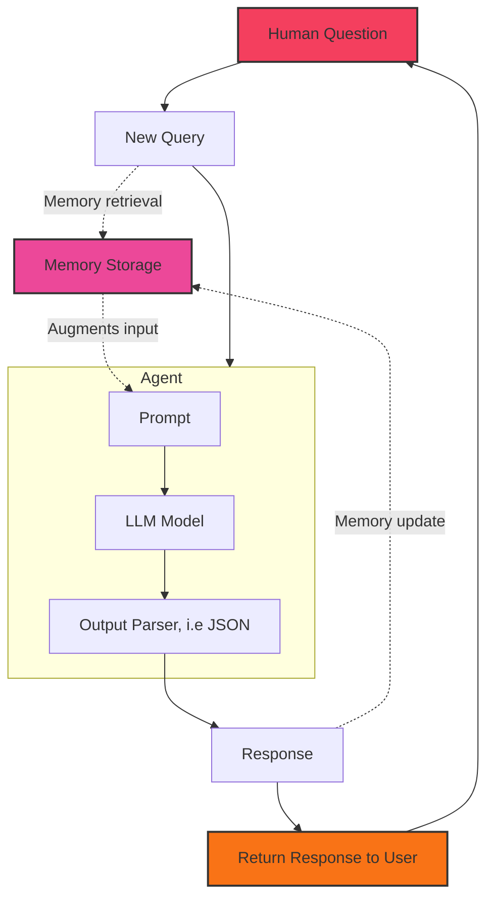

<Note>
    This article is part 5 of the Generative AI for Finance series, and is written using LangChain 0.3.2. 
    
    For best results, it is recommended to consume the series in order, starting from [chapter 1](/recipes/generative-ai-python/01-background).
    
    For continuity purposes, I will point out the key differences between the current version (LangChain 0.3.2, using `runnables`) and the older implementations featuring `LLMChain` and `ConversationChain`.
</Note>

## Conversational AI with Memory
Oftentimes, we design our AI agents to be conversational, allowing them to interact with users 
in a more human-like manner. Part 5 of the Generative AI series is on building a conversational AI agent with 
memory capabilities, which can "remember" past interactions in the conversation and use that 
information to generate more contextually relevant responses.

The essential components of a memory system requires:
1. **Memory Storage**: A mechanism to store and retrieve information.
2. **Memory Update**: A mechanism to update the memory based on new information.
3. **Memory Retrieval**: A mechanism to retrieve information from memory.

Instead of operating in a stateless manner, we will be constructing a system where the prompt 
is augmented with memory information before being passed to the model, and subsequently 
updating this memory with the agent's response. In other words, this chain will be interacting 
with this memory system twice in any given conversation turn, once to perform (3) Memory Retrieval
and once to perform (2) Memory Update.



Observe where the memory system is integrated into the agent's workflow. Also note how the chain:
1. Augments the user input with memory information **before** passing it to the model. This happens 
   after receiving the user input but before the agent performs any processing.
2. Updates the memory with the agent's response **after** the model has generated a response, typically
    before returning the response to the user. This adds information to the memory storage that future
    conversation turns can refer to.

Underlying this memory system can range from simple key-value stores to more complex storage systems that 
offer persistence and authentication features. 

In the past, memory-backed AI agents were typically implemented with either a `LLMChain` or `ConversationChain`, and 
the simplicity of these classes made it easy to showcase the memory system. I will first demonstrate how that is 
done before moving on to the newer, more flexible `RunnableWithMessageHistory` class as recommended in the
latest version of LangChain (0.3.2).

### Memory in `LLMChain` and `ConversationChain`
<Warning>
    This sub-section demonstrates the memory system in LangChain's `LLMChain` and `ConversationChain` classes.

    As of LangChain 0.3.0 (mid-October '24), these two will yield a `LangChainDeprecationWarning` warning.
    
    - The class `LLMChain` was deprecated in LangChain 0.1.17 and will be removed in 1.0. Use :meth:`~RunnableSequence, e.g., `prompt | llm`` instead.
    - The class `ConversationChain` was deprecated in LangChain 0.2.7 and will be removed in 1.0. Use :meth:`~RunnableWithMessageHistory: https://python.langchain.com/v0.2/api_reference/core/runnables/langchain_core.runnables.history.RunnableWithMessageHistory.html` instead.

    The **rest of this article outside of this sub-chapter will be using the newest, recommended classes** (as of October '24).
</Warning>


<CodeGroup>
```python ConversationChain
from langchain.memory import ConversationBufferMemory
from langchain_groq import ChatGroq
from langchain_core.prompts.prompt import PromptTemplate
from langchain.chains import ConversationChain

load_dotenv()
GROQ_API_KEY = os.getenv("GROQ_API_KEY")

llm = ChatGroq(model="llama3-8b-8192")

template = """The following is a friendly conversation between a human and a financial stock advisor AI with specific knowledge of the Indonesian stock market (IDX). 
The AI is talkative and provides lots of specific details from its context. If the AI does not know the answer to a question, it truthfully says it does not know.
    Current conversation:
    {history}
    Human: {input}
    AI Assistant:"""


prompt = PromptTemplate(input_variables=["history", "input"], template=template)

conversation = ConversationChain(
    llm=llm,
    prompt=prompt,
    verbose=True,
    memory=ConversationBufferMemory(memory_key="history")
)
```

```python LLMChain
from langchain.memory import ConversationBufferMemory
from langchain_groq import ChatGroq
from langchain_core.prompts.prompt import PromptTemplate
from langchain.chains import LLMChain

load_dotenv()
GROQ_API_KEY = os.getenv("GROQ_API_KEY")

llm = ChatGroq(model="llama3-8b-8192")

template = """The following is a friendly conversation between a human and a helpful AI assistant. 
    If the AI does not know the answer to a question, it truthfully says it does not know.
    Current conversation:
    {history}
    Human: {input}
    AI Assistant:"""


prompt = PromptTemplate(input_variables=["history", "input"], template=template)

conversation = LLMChain(
    llm=llm, 
    prompt=prompt, 
    verbose=True, 
    memory=ConversationBufferMemory(memory_key="history")
)
```
</CodeGroup>

There are two key components in the code above, irrespective of whichever class you choose to use:

- The `PromptTemplate` class, which is used to define the template for the prompt. How we name the variables in the template is important, as it will be used to match the keys in the memory system.

- The `ConversationBufferMemory` class, which is a simple memory system that stores the conversation history in a buffer.
  It requires a `memory_key` to match the key in the prompt template. 

Since we have `{history}` in the prompt template, the memory system will store the conversation history under the key `history`, which will be used to augment the prompt before passing it to the model.

If desired, one can also manipulate the memory system by adding user or AI messages to the conversation history through the `chat_memory` attribute.

```python
memory = ConversationBufferMemory()
memory.chat_memory.add_user_message("hi! I'm curious about the Indonesian stock market.")
memory.chat_memory.add_ai_message("i'm here to help! what would you like to know?")
```


Once you have the `ConversationChain` or `LLMChain` set up, you can interact with it as you would with any other chain. The memory system will automatically update the conversation history with each turn, 
and the model will be able to access this history in subsequent turns.

```python
>>> conversation.run("which country does the great nusantara likely refers to?")

# output:
"""
A question that takes us back to the rich history of Indonesia! The term "Nusantara" is a Sanskrit 
word that refers to the Indonesian archipelago. In fact, the name "Indonesia" itself is derived 
from the Latinised form of "Nusantara". So, to answer your question, the term "Nusantara" likely 
refers to Indonesia.'
"""

>>> conversation.run("what is the name of the central bank of that country?")

# output:
"""
That's a great question! In Indonesia, the central bank is called Bank Indonesia (BI). It's responsible 
for monetary policy, regulating the financial system, and maintaining financial stability in the country.
"""

>>> conversation.run("with whom does this country compete with, economically?")
"""
In terms of economic competition, Indonesia is a significant player in the Southeast Asian region and 
competes with other neighboring countries such as Malaysia, Thailand, and the Philippines. However, if 
I'm being more specific, Indonesia is also part of the Association of Southeast Asian Nations (ASEAN) and 
competes with other ASEAN member states such as Vietnam, Singapore, and the Philippines in terms of 
attracting foreign investments, exports, and tourism.

In terms of the stock market, Indonesia's IDX (Indonesia Stock Exchange) competes with other Southeast Asian 
exchanges such as the Kuala Lumpur Stock Exchange (KLSE) in Malaysia, the Stock Exchange of Thailand (SET), 
and the Philippine Stock Exchange (PSE).
"""
```

Notice the answers to each prompt are contextually relevant to the conversation history. The AI agent 
could not have understood the question about the "central bank of that country" or "with whom does this country compete with"
without these information injected into the prompt from the conversation history.

### Conversational Agents through `RunnableWithMessageHistory`
If you're going through the Generative AI series on your own, you'd probably be reading this article 
closer to the end of 2024 or later. In that case, you should be using the `RunnableWithMessageHistory` class
along with the LCEL (LangChain Expression Language) to build your conversational AI agents. This is covered in 
[Chapter 4: Tool-Use ReAct Agents](/recipes/generative-ai-python/04-conversational) of the series.

