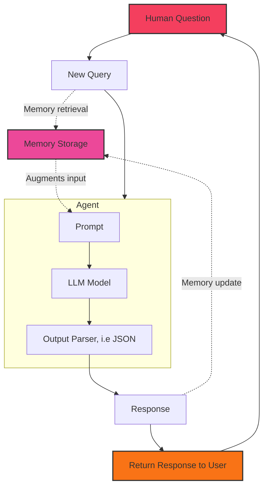

import {TOC} from '/snippets/generative-ai-toc.mdx';

<TOC step={5} />

<Note>
    This article is part 5 of the Generative AI for Finance series, and is written using LangChain 0.3.2. 
    
    For best results, it is recommended to consume the series in order, starting from [chapter 1](/recipes/generative-ai-python/01-background).
    
    For continuity purposes, I will point out the key differences between the current version (LangChain 0.3.2, using `runnables`) and the older implementations featuring `LLMChain` and `ConversationChain`.
</Note>

## Conversational AI with Memory
Oftentimes, we design our AI agents to be conversational, allowing them to interact with users 
in a more human-like manner. Part 5 of the Generative AI series is on building a conversational AI agent with 
memory capabilities, which can "remember" past interactions in the conversation and use that 
information to generate more contextually relevant responses.

The essential components of a memory system requires:
1. **Memory Storage**: A mechanism to store and retrieve information.
2. **Memory Update**: A mechanism to update the memory based on new information.
3. **Memory Retrieval**: A mechanism to retrieve information from memory.

Instead of operating in a stateless manner, we will be constructing a system where the prompt 
is augmented with memory information before being passed to the model, and subsequently 
updating this memory with the agent's response. In other words, this chain will be interacting 
with this memory system twice in any given conversation turn, once to perform (3) Memory Retrieval
and once to perform (2) Memory Update.



Observe where the memory system is integrated into the agent's workflow. Also note how the chain:
1. Augments the user input with memory information **before** passing it to the model. This happens 
   after receiving the user input but before the agent performs any processing.
2. Updates the memory with the agent's response **after** the model has generated a response, typically
    before returning the response to the user. This adds information to the memory storage that future
    conversation turns can refer to.

Underlying this memory system can range from simple key-value stores to more complex storage systems that 
offer persistence and authentication features. 

In the past, memory-backed AI agents were typically implemented with either a `LLMChain` or `ConversationChain`, and 
the simplicity of these classes made it easy to showcase the memory system. I will first demonstrate how that is 
done before moving on to the newer, more flexible `RunnableWithMessageHistory` class as recommended in the
latest version of LangChain (0.3.2).

### Memory in `LLMChain` and `ConversationChain`
<Warning>
    This sub-section demonstrates the memory system in LangChain's `LLMChain` and `ConversationChain` classes.

    As of LangChain 0.3.0 (mid-October '24), these two will yield a `LangChainDeprecationWarning` warning.
    
    - The class `LLMChain` was deprecated in LangChain 0.1.17 and will be removed in 1.0. Use :meth:`~RunnableSequence, e.g., `prompt | llm`` instead.
    - The class `ConversationChain` was deprecated in LangChain 0.2.7 and will be removed in 1.0. Use :meth:`~RunnableWithMessageHistory: https://python.langchain.com/v0.2/api_reference/core/runnables/langchain_core.runnables.history.RunnableWithMessageHistory.html` instead.

    The **rest of this article outside of this sub-chapter will be using the newest, recommended classes** (as of October '24).
</Warning>


<CodeGroup>
```python ConversationChain
from langchain.memory import ConversationBufferMemory
from langchain_groq import ChatGroq
from langchain_core.prompts.prompt import PromptTemplate
from langchain.chains import ConversationChain

load_dotenv()
GROQ_API_KEY = os.getenv("GROQ_API_KEY")

llm = ChatGroq(model="llama3-8b-8192")

template = """The following is a friendly conversation between a human and a financial stock advisor AI with specific knowledge of the Indonesian stock market (IDX). 
The AI is talkative and provides lots of specific details from its context. If the AI does not know the answer to a question, it truthfully says it does not know.
    Current conversation:
    {history}
    Human: {input}
    AI Assistant:"""


prompt = PromptTemplate(input_variables=["history", "input"], template=template)

conversation = ConversationChain(
    llm=llm,
    prompt=prompt,
    verbose=True,
    memory=ConversationBufferMemory(memory_key="history")
)
```

```python LLMChain
from langchain.memory import ConversationBufferMemory
from langchain_groq import ChatGroq
from langchain_core.prompts.prompt import PromptTemplate
from langchain.chains import LLMChain

load_dotenv()
GROQ_API_KEY = os.getenv("GROQ_API_KEY")

llm = ChatGroq(model="llama3-8b-8192")

template = """The following is a friendly conversation between a human and a helpful AI assistant. 
    If the AI does not know the answer to a question, it truthfully says it does not know.
    Current conversation:
    {history}
    Human: {input}
    AI Assistant:"""


prompt = PromptTemplate(input_variables=["history", "input"], template=template)

conversation = LLMChain(
    llm=llm, 
    prompt=prompt, 
    verbose=True, 
    memory=ConversationBufferMemory(memory_key="history")
)
```
</CodeGroup>

There are two key components in the code above, irrespective of whichever class you choose to use:

- The `PromptTemplate` class, which is used to define the template for the prompt. How we name the variables in the template is important, as it will be used to match the keys in the memory system.

- The `ConversationBufferMemory` class, which is a simple memory system that stores the conversation history in a buffer.
  It requires a `memory_key` to match the key in the prompt template. 

Since we have `{history}` in the prompt template, the memory system will store the conversation history under the key `history`, which will be used to augment the prompt before passing it to the model.

If desired, one can also manipulate the memory system by adding user or AI messages to the conversation history through the `chat_memory` attribute.

```python
memory = ConversationBufferMemory()
memory.chat_memory.add_user_message("hi! I'm curious about the Indonesian stock market.")
memory.chat_memory.add_ai_message("i'm here to help! what would you like to know?")
```


Once you have the `ConversationChain` or `LLMChain` set up, you can interact with it as you would with any other chain. The memory system will automatically update the conversation history with each turn, 
and the model will be able to access this history in subsequent turns.

```python
>>> conversation.run("which country does the great nusantara likely refers to?")

# output:
"""
A question that takes us back to the rich history of Indonesia! The term "Nusantara" is a Sanskrit 
word that refers to the Indonesian archipelago. In fact, the name "Indonesia" itself is derived 
from the Latinised form of "Nusantara". So, to answer your question, the term "Nusantara" likely 
refers to Indonesia.'
"""

>>> conversation.run("what is the name of the central bank of that country?")

# output:
"""
That's a great question! In Indonesia, the central bank is called Bank Indonesia (BI). It's responsible 
for monetary policy, regulating the financial system, and maintaining financial stability in the country.
"""

>>> conversation.run("with whom does this country compete with, economically?")
"""
In terms of economic competition, Indonesia is a significant player in the Southeast Asian region and 
competes with other neighboring countries such as Malaysia, Thailand, and the Philippines. However, if 
I'm being more specific, Indonesia is also part of the Association of Southeast Asian Nations (ASEAN) and 
competes with other ASEAN member states such as Vietnam, Singapore, and the Philippines in terms of 
attracting foreign investments, exports, and tourism.

In terms of the stock market, Indonesia's IDX (Indonesia Stock Exchange) competes with other Southeast Asian 
exchanges such as the Kuala Lumpur Stock Exchange (KLSE) in Malaysia, the Stock Exchange of Thailand (SET), 
and the Philippine Stock Exchange (PSE).
"""
```

Notice the answers to each prompt are contextually relevant to the conversation history. The AI agent 
could not have understood the question about the "central bank of that country" or "with whom does this country compete with"
without these information injected into the prompt from the conversation history.

## Conversational Agents through `RunnableWithMessageHistory`
If you're going through the Generative AI series on your own, you'd probably be reading this article 
closer to the end of 2024 or later. In that case, you should be using the `RunnableWithMessageHistory` class
along with the LCEL (LangChain Expression Language) to build your conversational AI agents. ReAct agents and LCEL 
are topics covered in [Chapter 4: Tool-Use ReAct Agents](/recipes/generative-ai-python/04-conversational) of the series.

The key changes with LangChain 0.3.2 and above are the use of `RunnableWithMessageHistory` to construct a 
`runnable` -- consistent with what we've learned in previous chapters of this series -- and a more explictly 
way of handling message history through `InMemoryChatMessageHistory`. `RunnableWithMessageHistory` wraps around a runnable (like 
the ones we've seen before) but with the added capability of working with chat message history, thus allowing this 
runnable to read and update the message history in a conversation. 

Unlike other runnables, `RunnableWithMessageHistory` must always be invoked with a `config` that contains the parameters
for the chat message history.

Let's start with the imports and set up a runnable chain much like you've done in the previous chapters.

```python
import os
from dotenv import load_dotenv

from langchain_groq import ChatGroq
from langchain_core.prompts import ChatPromptTemplate, MessagesPlaceholder

load_dotenv()

GROQ_API_KEY = os.getenv("GROQ_API_KEY")
llm = ChatGroq(model="llama3-8b-8192")

prompt = ChatPromptTemplate.from_messages(
    [
        (
            "system",
            "You're a financial stock advisor with adept knowledge of the Indonesian stock exchange (IDX) and adept at analysing, summarizing, inferring trends from financial information",
        ),
        MessagesPlaceholder(variable_name="history"),
        ("human", "{question}"),
    ]
)

chain = prompt | llm
```

Again, pay special attention to the variable names in the prompt template. We have decided to call it `history` and `question`, but your use-case may vary.
The big picture idea isn't much different from the previous examples, where we are creating these variables to allow the memory system to augment the prompt before passing it to the model. 
Set aside syntactic differences, the key idea is to inject, or "copy-paste", into the prompt past conversational rounds so the prompt is contextually informative.

<Tip>
In a production environment, you might use a persistent implementation of key-value store for this message history, like 
[`RedisChatMessageHistory`](https://api.python.langchain.com/en/latest/chat_message_histories/langchain_community.chat_message_histories.redis.RedisChatMessageHistory.html) or [`MongoDBChatMessageHistory`](https://python.langchain.com/api_reference/mongodb/).

View the full list of integration packages and providers on [LangChain Providers](https://python.langchain.com/docs/integrations/platforms/).
</Tip>

With our runnable `chain` set up, let's now:
- Create an in-memory dictionary to store the message history based on a unique session id
- Wrap our `chain` with `RunnableWithMessageHistory` to handle the message history through matching the variables in the prompt template.

```python
store = {}

def get_session_history_by_id(session_id: str):
    if session_id not in store:
        store[session_id] = InMemoryChatMessageHistory()
    return store[session_id]

with_memory = RunnableWithMessageHistory(
    chain,
    get_session_history_by_id,
    # the two variables in the prompt are named 'question' and 'history'
    input_messages_key="question",
    history_messages_key="history",
)
```

The `get_session_history_by_id` function retrieves the message history based on a unique session id. 
If the `session_id` is not found in the store, it means the user has not interacted with the agent before, and 
so a new `InMemoryChatMessageHistory` object is created and stored in the dictionary.

### Runnable with Message History in Action
With all of that in place, let us now interact with our `with_memory` runnable to see how it performs in a conversation.

```python
out = with_memory.invoke(
    {"question": "What are some investable companies on the Indonesian stock market?"},
    config={"configurable": {"session_id": "supertype"}},
)
```

Because `supertype` is not present in `store`, a new `InMemoryChatMessageHistory` object is created on our memory store under the `supertype` key.
Subsequent interactions with the agent using this `session_id` will refer to this key (pointing to an object containing the conversation history).

Just as how we initialized `store` as an empty dictionary, `print(store)` will show you that the structure of this dictionary is as follows:

```python
{
    "supertype": InMemoryChatMessageHistory(),
    # other session ids and their respective InMemoryChatMessageHistory objects
    "another_session_id": InMemoryChatMessageHistory(),
    ...
}

print(type(store))
# output: <class 'dict'>
```


And since our `store` has been updated with this new key, let's also print out the content of this new key-value pair:

```python
print(store['supertype'])

"""
Human: What are some investable companies on the Indonesian stock market?
AI: The Indonesian stock market, also known as the Indonesia Stock Exchange (IDX), offers a wide range of investable companies across various sectors. Here are some of the most popular and attractive companies to consider:

1. Bank Central Asia (BBCA): One of the largest banks in Indonesia, with a strong presence in consumer lending and corporate banking.
2. Bank Rakyat Indonesia (BBRI): Another major bank in Indonesia, with a focus on microfinance and community development.
3. Astra International (ASII): A diversified conglomerate with interests in automotive, agribusiness, mining, and infrastructure.
4. Indocement (INTP): A leading cement producer in Indonesia, with a strong market presence and a focus on sustainability.
5. Indofood Sukses Makmur (INDF): A food and beverage company with a wide range of products, including instant noodles, coffee, and dairy products.
6. Unilever Indonesia (UNVR): A consumer goods company with a portfolio of well-known brands, including food, beverages, and personal care products.
7. Aneka Tambang (ANTM): A mining company with a focus on nickel, gold, and copper production.
8. Adaro Energy (ADRO): A coal mining and energy company with a strong presence in Indonesia's energy sector.
9. Gudang Garam (GGRM): A leading tobacco company in Indonesia, with a focus on high-quality cigarette products.
10. PPB (PPB): A food and beverage company with a focus on instant noodles, coffee, and other packaged goods.
11. MNC Group (MNCN): A media and entertainment company with interests in television, radio, and film production.
12. XL Axiata (EXCL): A telecommunications company with a focus on mobile and internet services.
13. Bank Mandiri (BMTR): A major bank in Indonesia, with a strong presence in consumer and corporate lending.
14. Bumi Resources (BUMI): A mining company with a focus on coal and iron ore production.
15. Bakrie & Brothers (BNBR): A conglomerate with interests in energy, mining, and real estate.

These companies are listed on the IDX and are considered to be investable, but it's essential to conduct thorough research and due diligence before making any investment decisions. It's also important to consider factors such as valuation, financial performance, industry trends, and macroeconomic conditions before investing in any company.

In addition to these individual companies, investors may also consider investing in exchange-traded funds (ETFs) or index funds that track the IDX or specific sectors within the market. These types of funds can provide diversification and exposure to a broader range of companies and industries.
"""
```

So far, it's looking good! The agent has provided a detailed, on-point response to the user's question. Now, let's test the agent's memory by asking a follow-up question 
that relies on the information provided in the previous response.

```python
out2 = with_memory.invoke(
    {"question": "Tell me more about the first three companies on the list"},
    config={"configurable": {"session_id": "supertype"}},
)

print(out2.content)

"""
Let me provide you with more information about the first three companies on the list:

**1. Bank Central Asia (BBCA)**

Bank Central Asia (BBCA) is one of the largest banks in Indonesia, with a market capitalization of around IDR 150 trillion (approximately USD 10 billion). The bank was founded in 1958 and is headquartered in Jakarta.
BBCA is a universal bank that offers a wide range of financial services, including consumer lending, corporate banking, treasury, and investment banking. The bank has a strong presence in Indonesia, with over 1,000 branches and 10,000 ATMs across the country.
BBCA has a solid financial track record, with a strong capital adequacy ratio and a low non-performing loan (NPL) ratio. The bank has also been recognized for its commitment to corporate social responsibility and sustainability.

Some of the key factors that make BBCA an attractive investment opportunity include:

* Strong brand recognition and market presence
* Diversified revenue stream from various business segments
* Robust financial performance, with a strong capital position and low NPL ratio
* Growing demand for financial services in Indonesia, driven by economic growth and increasing middle-class consumption

**2. Bank Rakyat Indonesia (BBRI)**

Bank Rakyat Indonesia (BBRI) is another major bank in Indonesia, with a market capitalization of around IDR 120 trillion (approximately USD 8 billion). The bank was founded in 1897 and is headquartered in Jakarta.
BBRI is a commercial bank that focuses on microfinance and community development, with a strong presence in rural areas. The bank has a network of over 1,000 branches and 10,000 ATMs across Indonesia.
BBRI has a strong commitment to social responsibility and sustainability, and has been recognized for its efforts to promote financial inclusion and entrepreneurship in Indonesia. The bank has also been expanding its digital banking capabilities, with a focus on mobile banking and online services.

Some of the key factors that make BBRI an attractive investment opportunity include:

* Strong commitment to social responsibility and sustainability
* Diversified revenue stream from various business segments, including microfinance and corporate banking
* Growing demand for financial services in Indonesia, driven by economic growth and increasing middle-class consumption
* Strong brand recognition and market presence

**3. Astra International (ASII)**

Astra International (ASII) is a diversified conglomerate with interests in various sectors, including automotive, agribusiness, mining, and infrastructure. The company was founded in 1957 and is headquartered in Jakarta.
ASII has a strong presence in Indonesia's automotive sector, with a market share of around 50% in the domestic market. The company also has interests in agribusiness, with a focus on palm oil and soybean production. ASII also has a significant presence in mining, with a focus on nickel and coal production.
ASII has a strong financial track record, with a solid balance sheet and a track record of generating strong profits. The company has also been recognized for its commitment to sustainability and social responsibility.

Some of the key factors that make ASII an attractive investment opportunity include:

* Diversified revenue stream from various business segments
* Strong presence in Indonesia's automotive and agribusiness sectors
* Growing demand for infrastructure development in Indonesia, driven by economic growth and urbanization
* Strong brand recognition and market presence

These three companies offer investors a range of opportunities to participate in Indonesia's growing economy, from financial services to consumer goods and infrastructure development. However, as with any investment, it's essential to conduct thorough research and due diligence before making a decision.
"""
```

### Different `session_id` for different Conversations

It does look like our AI agent handled that follow-up question well! 

By matching the `session_id`, it was able to identify which companies were being referred to and inject the right 
context from our memory store.

Now that our conversation has grown a little longer, let's see if it still maintains context in the next question.

```python
out3 = with_memory.invoke(
    {
        "question": "Which from the original list are not in the financial sector? I have too much exposure to that sector and wish to diversify away from banking"
    },
    config={"configurable": {"session_id": "supertype"}},
)

print(out3.content)

"""
Based on the original list, the following companies are not in the financial sector:

* Astra International (ASII) - diversified conglomerate with interests in automotive, agribusiness, mining, and infrastructure.
* Indofood Sukses Makmur (INDF) - food and beverage company with a wide range of products, including instant noodles, coffee, and dairy products.
* Gudang Garam (GGRM) - leading tobacco company in Indonesia, with a focus on high-quality cigarette products.

These companies operate in different sectors, such as manufacturing, consumer goods, and commodities, which can help you diversify away from the financial sector.

Astra International, as a conglomerate, has a diversified portfolio of businesses, which can provide a buffer against market volatility and sector-specific risks.

Indofood Sukses Makmur is a leading player in Indonesia's food and beverage industry, with a strong brand presence and a wide range of products that cater to various consumer segments.

Gudang Garam is a well-established tobacco company with a strong market presence in Indonesia. While the tobacco industry has its own set of regulatory and reputational risks, Gudang Garam has a strong brand reputation and a diversified product portfolio.

These companies can provide a good starting point for diversifying away from the financial sector..
"""
```

It seems that the AI agent performs admirably in this conversation, providing contextually relevant responses based on the conversation history. Just to test 
its ability to order these message histories sequentially, I've asked it for the second question as well:

```python
out4 = with_memory.invoke(
    {
        "question": "What was the second question i asked you?"
    },
    config={"configurable": {"session_id": "supertype"}},
)

print(out4.content)

# output:
"""
Your second question was: "Tell me more about the first three companies on the list"
"""
```

For the most part, the AI agent's ability to store and retrieve these message histories, and the quality of this ability, will be  
dependent on the way we set up the memory system as well as the LLM model itself. If you have been following along with your 
own LLM model, you might notice a difference in the quality of responses compared to the examples above.

It should come as no surprise that when we try to access a different `session_id`, the agent will not be able to retrieve the conversation history
from the `store` dictionary and will promptly create a new `InMemoryChatMessageHistory` object for that `session_id`, as implemented in the `get_session_history_by_id` function.

```python
out2 = with_memory.invoke(
    {"question": "What was the second question i asked you?"},
    config={"configurable": {"session_id": "2"}},
)

print(out2.content)
# output:
# I apologize, but this is the beginning of our conversation, and you haven't asked me any questions yet. 
# I'm here to help, so feel free to ask me anything you'd like!
```

### Advanced configuration for message histories tracking
Recall that this is our current implementation carried over from the previous sections:

```python
with_memory = RunnableWithMessageHistory(
    chain,
    get_session_history_by_id,
    input_messages_key="input", # originally 'question'
    history_messages_key="history",
)
```

This function in fact, also accepts an optional parameter, `history_factory_config` that expects a list of `ConfigurableFieldSpec` objects.

```python
from langchain_core.runnables import ConfigurableFieldSpec

with_memory = RunnableWithMessageHistory(
    chain,
    get_session_history_by_uid_and_convoid,
    input_messages_key="input",
    history_messages_key="history",
    history_factory_config=[
        ConfigurableFieldSpec(
            id="user_id",
            annotation=str,
            name="User ID",
            description="Unique identifier for the user.",
            default="",
            is_shared=True,
        ),
        ConfigurableFieldSpec(
            id="conversation_id",
            annotation=str,
            name="Conversation ID",
            description="Unique identifier for the conversation.",
            default="",
            is_shared=True,
        ),
    ],
)
```

Notice that I've also changed the `get_session_history` to this new function that I have yet to create, so let's go ahead 
and create it:

```python
# Create an in-memory chat history store
store = {}


def get_session_history_by_uid_and_convoid(user_id: str, conversation_id: str):
    concatenated = f"{user_id}_{conversation_id}"

    if concatenated not in store:
        store[concatenated] = InMemoryChatMessageHistory()
    return store[concatenated]
```

I have also slightly modified my `prompt` for this example, even though it's not necessary for the 
`history_factory_config` to work. 

```python
prompt = ChatPromptTemplate.from_messages(
    [
        (
            "system",
            """You're a bilingual financial stock advisor with adept knowledge of the Indonesian stock exchange (IDX). Answer the users queries with respect to his stock holdings. 
            Answer in the {language} language, but be casual and not too overly formal.
            The user's holdings are: {holdings}
            """,
        ),
        MessagesPlaceholder(variable_name="history"),
        ("human", "{input}"),
    ]
)

chain = prompt | llm
```

Now, to invoke our runnable with the new `history_factory_config`, your `config` will have to match 
the specifications constructed with the `ConfigurableFieldSpec` objects.

```python
# correct:
with_memory.invoke(
    ...,
    config={
        "configurable": {
            "user_id": "001",
            "conversation_id": "1",
        }
    },
)

# wrong: 'language' is not known in the history_factory_config
with_memory.invoke(
    ...,
    config={
        "configurable": {
            "user_id": "001",
            "conversation_id": "1",
            "language": "Bahasa Indonesia",
        }
    },
)
```

We are going to pretend that we have some internal database that provide us with the stocks owned by the respective 
users, and mock them up for now. Here's my implementation of `_get_stocks_of_user` and `_get_user_settings_preferences`:

```python 
def chat(user_id: str, input: str, conversation_id: int = 1):

    # you can replace this with your own database query
    def _get_stocks_of_user(user_id: str):
        if user_id == "001":
            return ["BBCA", "ADRO", "BBRI", "GOTO"]
        if user_id == "002":
            return ["BBCA", "ADRO", "BBRI"]
        return []

    # again, replace this with your own database query
    def _get_user_settings_preferences(user_id):
        return {
            "language": "Bahasa Indonesia",
            "join_date": "2024-11-01",
        }

    return with_memory.invoke(
        {
            "holdings": _get_stocks_of_user(user_id),
            "language": _get_user_settings_preferences(user_id)["language"],
            "input": input,
        },
        config={
            "configurable": {
                "user_id": user_id,
                "conversation_id": str(conversation_id),
            }
        },
    )
```

And now I can initiate a chat, first using user Sam (id `001`), and then user Anonymous (id `002`). 

```python
out = chat(
    user_id="001",
    input="hi, my name is Sam. What stocks do i own? I can't remember",
)

print(out.content)
# Hi Sam! Tidak apa-apa, kita bisa cek bersama! Kamu memiliki saham dari beberapa perusahaan, yaitu BBCA, ADRO, BBRI, dan GOTO.
```

Since I did not specify any `conversation_id`, it will default to `1`. This is verified 
by printing the `store` dictionary after the first chat:

```python
print(store.keys())
# output: dict_keys(['001_1'])
```

Now with the Anonymous user, we are going to issue a `conversation_id` of `1` explicitly, but due to 
the implementations of `get_session_history_by_uid_and_convoid`, it will still create a new `InMemoryChatMessageHistory` object. 
Let's verify that asking the AI for the name (user 1 introduces himself as Sam) will not work for user 2.

```python
out2 = chat(
    user_id="002",
    input="hi, what did i say my name was? Also, please print the full name of the companies I own",
)

# Hi there! You didn't mention your name, so I'll just address you as "teman" (friend) for now.

# As for your stock holdings, you currently own shares of:
# 1. Bank Central Asia (BBCA) 
# 2. PT Adaro Energy Tbk (ADRO)
# 3. Bank Rakyat Indonesia (Persero) Tbk (BBRI)
```

Notice that even though the `conversation_id` is the same, our function is implemented in such a way that the 
AI agent will treat it as a separate conversation. 

```python
print(store.keys())
# output: dict_keys(['001_1', '002_1'])
```

Whenever Sam is ready to continue the conversation, he can do so with the same `conversation_id` of `1`:

```python
out = chat(
    user_id="001",
    input="tell me more about the first one on the list?",
    conversation_id=1, # can omit, default=1 anyway
)

# out.content
"""
"Hey Sam! So, you want to know more about the first one on the list, BBCA? Well, I can tell you that it's one of the largest commercial banks in Indonesia. 
They offer a range of financial services, from personal banking to corporate banking, and even have a presence in other countries.

As a stock, BBCA has been performing relatively well in recent years, with a steady increase in its stock price. It's considered a relatively stable investment, 
with a strong brand and a large customer base. However, as with any stock, there are always risks and uncertainties involved.

If you're looking to learn more, I can give you some insights or even provide some analysis on the stock's performance."
"""

out = chat(
    user_id="001",
    input="sure. tell me if i should hold it long term?",
)

# out.content
"""
"Whether you should hold BBCA long-term depends on your investment goals and risk tolerance. As I mentioned earlier, BBCA has been performing relatively well, 
but it's always important to consider the bigger picture.

From a fundamental perspective, BBCA has a strong financial position, with a solid capital adequacy ratio and a manageable debt level. They've also been making 
efforts to diversify their revenue streams and improve their digital offerings.

That being said, the banking industry in Indonesia is highly competitive, and BBCA faces intense competition from other major banks like BRI and Mandiri. 
Additionally, there are always potential risks from macroeconomic factors, such as interest rate changes or currency fluctuations.

If you're looking to hold BBCA long-term, I'd say it's a relatively stable investment with a strong brand and a large customer base. However, it's always 
important to monitor the stock's performance and adjust your strategy as needed.

If you're willing to take on a bit more risk, you could also consider exploring other stocks in the Indonesian market. There are many exciting companies in 
various sectors that could potentially provide higher returns over the long term.\n\nWhat do you think, Sam? Are you looking to hold BBCA long-term, 
or are you considering other options?"
"""
```

### `SQLChatMessageHistory` 
Memory implementations vary from simple in-memory dictionaries to more complex, persistent storage systems. The exact 
implementation will depend on your specific use case, requirements, as well as the library you choose. 

To demonstrate a more persistent memory system, I will show you how to use `SQLChatMessageHistory` with SQLite.

Start with installing the `langchain-community` package, which contains the `SQLChatMessageHistory` class. As always, I 
recommend doing this in a virtual environment.

```bash
pip install langchain-community
```

Now, import the `SQLChatMessageHistory` class and modify your `get_session_history_by_uid_and_convoid` function to use it,
swapping out `InMemoryChatMessageHistory` for `SQLChatMessageHistory`.

```python
- from langchain_core.chat_history import InMemoryChatMessageHistory
+ from langchain_community.chat_message_histories import SQLChatMessageHistory

def get_session_history_by_uid_and_convoid(user_id: str, conversation_id: str):
    concatenated = f"{user_id}_{conversation_id}"

    # if concatenated not in store:
    #     store[concatenated] = InMemoryChatMessageHistory()
    # return store[concatenated]
    return SQLChatMessageHistory(concatenated, "sqlite:///memory.db")
```

With SQLite, is a database of that name is not found, it will be created for you. There is no 
separate setup required for the creation of this database. 

The rest of your code should remain the same, but now when we call `chat(user_id, input)` for the 
first time, it will create a new `memory.db` file in the same directory as your script. 

```bash
>>> tree
.
├── memory.db
├── .env
└── your_script.py
```

Exploring the database, we can see a table named `message_store` being created for us, identical to 
the following schema:

```sql
CREATE TABLE message_store (
    id INTEGER PRIMARY KEY AUTOINCREMENT,
    session_id TEXT,
    message TEXT,
);
```

Executing `SELECT * FROM message_store` will show you the conversation history stored in the database:

```sql
id	session_id	message
1	001_1	{"type": "human", "data": {"content": "hi, my name is Sam. What stocks do i own? I can't remember", "additional_kwargs": {}, "response_metadata": {}, "type": "human", "name": null, "id": null, "example": false}}
2	001_1	{"type": "ai", "data": {"content": "Hai Sam! Jangan khawatir, kita bisa cek bersama. Kamu memiliki saham dari beberapa perusahaan, yaitu BBCA, ADRO, BBRI, dan GOTO.", "additional_kwargs": {}, "response_metadata": {"token_usage": {"completion_tokens": 45, "prompt_tokens": 104, "total_tokens": 149, "completion_time": 0.0375, "prompt_time": 0.011602009, "queue_time": 0.011325890000000002, "total_time": 0.049102009}, "model_name": "llama3-8b-8192", "system_fingerprint": "fp_af05557ca2", "finish_reason": "stop", "logprobs": null}, "type": "ai", "name": null, "id": "run-eeb5b59e-e257-4093-9cbc-fb40b041dc6f-0", "example": false, "tool_calls": [], "invalid_tool_calls": [], "usage_metadata": {"input_tokens": 104, "output_tokens": 45, "total_tokens": 149}}}
3	002_1	{"type": "human", "data": {"content": "hi, what did i say my name was? Also, please print the full name of the companies I own", "additional_kwargs": {}, "response_metadata": {}, "type": "human", "name": null, "id": null, "example": false}}
4	002_1	{"type": "ai", "data": {"content": "Halo! You didn't mention your name, so I'll just address you as \"user\" for now.\n\nAnd, no problem! You own shares of:\n\n1. Bank Rakyat Indonesia (BBCA)\n2. Adaro Energy Tbk (ADRO)\n3. PT Bank Rakyat Indonesia (Persero) Tbk (BBRI)\n\nLet me know what's on your mind, and I'll do my best to help you with your stock holdings!", "additional_kwargs": {}, "response_metadata": {"token_usage": {"completion_tokens": 97, "prompt_tokens": 105, "total_tokens": 202, "completion_time": 0.080833333, "prompt_time": 0.01259477, "queue_time": 0.0019365489999999992, "total_time": 0.093428103}, "model_name": "llama3-8b-8192", "system_fingerprint": "fp_a97cfe35ae", "finish_reason": "stop", "logprobs": null}, "type": "ai", "name": null, "id": "run-6e36701d-377f-426f-b44f-02da77304602-0", "example": false, "tool_calls": [], "invalid_tool_calls": [], "usage_metadata": {"input_tokens": 105, "output_tokens": 97, "total_tokens": 202}}}
```

<Card title="New to SQL and SQLite?" horizontal icon="cauldron" href="https://brillian.supertype.ai/essentials/sql">
    Once you've run the code above, a new database is created on your behalf by SQLite. This database exists on 
    your local machine and can be accessed using a SQLite client, or directly queried using SQL commands. 
    
    You can learn more about SQL in the [SQL Essentials](https://brillian.supertype.ai/essentials/sql)
    guide I wrote, but it is beyond the scope of this article. 
</Card>


## Adding memory to prebuilt `ReAct` agents
We've learned about the [prebuilt `ReAct` agents in the previous chapter](/recipes/generative-ai-python/04-conversational). Adding in-memory 
capabilities to these agents is actually fairly straightforward, so let's see a bare minimum example of how to do this.

```python
from langgraph.checkpoint.memory import MemorySaver

@tool
def get_company_overview(stock: str) -> str:
    """
    Get company overview
    """

    url = f"https://api.sectors.app/v1/company/report/{stock}/?sections=overview"

    return retrieve_from_endpoint(url)


llm = ChatGroq(
    temperature=0,
    model_name="llama3-groq-70b-8192-tool-use-preview",
    groq_api_key=GROQ_API_KEY,
)
tools = [
    get_company_overview, 
    # ... other tools
    ]
memory = MemorySaver()

app = create_react_agent(llm, tools, checkpointer=memory)
```

The key difference here is the addition of the `MemorySaver` class, which LangChain describes as an in-memory checkpoint saver.
Just like the `store={}` dictionary we used in the previous examples, this class also 
stores its checkpoints using a `defaultdict` in memory. 

I've mentioned that `create_react_agent` really requires two arguments: the `llm` model and the `tools` list, but 
accept additional keyword arguments. If you want to, you can also pass in a `state_modifier` that acts almost like 
a prompt (we've also seen this earlier):


```python
system_message = "You are an expert tool calling agent meant for financial data retriever and summarization. Use tools to get the information you need. If you do not know the answer to a question, say so."
app = create_react_agent(llm, 
    tools, 
    state_modifier=system_message, 
    checkpointer=memory
)
```
The rest of the code remains the same from earlier chapters.

I will leave it as an exercise for you to implement the other tools using the `@tool` decorator, but 
this serves as a sufficient example to demonstrate the use of a tool-using ("function calling") ReAct 
agent with memory capabilities.

```python
out = app.invoke({
        "messages": [
            HumanMessage(
                content="Give me an overview of ADRO"
            )
        ]
    }, config={"configurable": {"thread_id": "supertype"}})


# result:
print(out["messages"][-1].content)

"""
Adaro Energy Indonesia Tbk, listed as ADRO.JK, is a coal production company in the energy sector. 
It is headquartered at Menara Karya 23rd Floor Jl. H.R. Rasuna Said, Block X-5, Kav. 1-2 Jakarta 12950. 
The company has a market capitalization of 116,883,055,443,968, ranking it 18th in the market. 
It has 13,180 employees and is listed on the Main board since July 16, 2008. The latest closing price 
was 3,800 on October 8, 2024, with a daily close change of -0.0231362467866324. For more information, 
you can visit their website at www.adaro.com or contact them via email at mahardika.putranto@adaro.com 
or aditya.sudjono@adaro.com, or by phone at 021-25533000.
"""
```

A quick glance at [Sectors report on Adaro Energy Indonesia Tbk (ADRO)](https://sectors.app/idx/ADRO) will confirm 
that the information provided by the AI agent is accurate, and it was able to retrieve this information from the
`get_company_overview` tool.

In fact, if we so desire, we can also break down each intermediary message contained in the `out['messages']` list for inspection:

```bash
>>> [type(m) for m in out['messages']]

# output:
[
    <class 'langchain_core.messages.human.HumanMessage'>, 
    <class 'langchain_core.messages.ai.AIMessage'>, 
    <class 'langchain_core.messages.tool.ToolMessage'>, 
    <class 'langchain_core.messages.ai.AIMessage'>
]
```

- The first message is a `HumanMessage` object, which is the user's input (e.g. "Give me an overview of ADRO").
- The second message is an `AIMessage`, which reads the user's input and decides on the right tools to call
- The third message is a `ToolMessage`, which is the tool call itself (e.g. `get_company_overview`)
- The fourth message is another `AIMessage`, which is the AI agent's response to the user's input, in plain human language

Sequentially, the messages are as follows:

```txt
-> HumanMessage(content='Give me an overview of ADRO'...)
-> AIMessage(content='', additional_kwargs={'tool_calls': [{ '
    function': {'arguments': '{"stock": "ADRO"}', 'name': 'get_company_overview'}, 'type': 'function'}]}
)
-> ToolMessage(content='{"symbol": "ADRO.JK", "company_name": "Adaro Energy Indonesia Tbk", "overview": 
        {"listing_board": "Main", "industry": "Coal", "sub_industry": "Coal Production", "sector": "Energy", "sub_sector": "Oil, Gas & Coal", "market_cap": 116883055443968, 
        "market_cap_rank": 18, "address": "Menara Karya 23rd Floor Jl. H.R. Rasuna Said, Block X-5, Kav. 1-2 Jakarta 12950", "employee_num": 13180, "listing_date": "2008-07-16", 
        "website": "www.adaro.com", "phone": "021-25533000", "email": "mahardika.putranto@adaro.com ; aditya.sudjono@adaro.com", "last_close_price": 3800, 
        "latest_close_date": "2024-10-08", "daily_close_change": -0.0231362467866324}}', name='get_company_overview', ...)

-> AIMessage(content='Adaro Energy Indonesia Tbk, listed as ADRO.JK, is a coal production company in the energy sector. It is headquartered at Menara Karya 23rd Floor Jl. H.R. Rasuna Said, Block X-5, Kav. 1-2 Jakarta 12950. The company has a market capitalization of 116,883,055,443,968, ranking it 18th in the market. It has 13,180 employees and is listed on the Main board since July 16, 2008. The latest closing price was 3,800 on October 8, 2024, with a daily close change of -0.0231362467866324. For more information, you can visit their website at www.adaro.com or contact them via email at mahardika.putranto@adaro.com or aditya.sudjono@adaro.com, or by phone at 021-25533000.', additional_kwargs={}, response_metadata={'token_usage': {'completion_tokens': 203, 'prompt_tokens': 619, 'total_tokens': 822, 'completion_time': 0.651845143, 'prompt_time': 0.063395509, 'queue_time': 0.0008670310000000042, 'total_time': 0.715240652}, 'model_name': 'llama3-groq-70b-8192-tool-use-preview', 'system_fingerprint': 'fp_ee4b521143', 'finish_reason': 'stop', 'logprobs': None}, id='run-2d411070-5abe-41d1-af07-aec558a58093-0', usage_metadata={'input_tokens': 619, 'output_tokens': 203, 'total_tokens': 822})
```

Given how often we want to be interacting with the AI agent, I've wrapped the invocation logic into `chat()` 
and we will now proceed to ask a few follow up questions to see the memory in action.

```python
def chat(session_id: str, input: str) -> str:
    out = app.invoke(
        {
            "messages": [
                HumanMessage(
                    content=input,
                    session_id=session_id,
                )
            ]
        },
        config=config,
    )
    return out["messages"][-1].content

# invoke the chat to ask a follow up question
chat("supertype", "what is the latest change in closing price? multiply by 100 to get percentage and answer in 2 decimals")
# output:
'The latest change in closing price for Adaro Energy Indonesia Tbk is -0.0231362467866324 * 100 = -2.31%.'


chat("supertype", "What is the market cap of Adaro again? Answer succinctly and round it up to billions if necessary, with the IDR currency prefix")
# output:
'The market capitalization of Adaro Energy Indonesia Tbk is approximately IDR 116.9 billion.'
```

To both of these follow-up questions, the AI agent was able to access and draw from its memory to provide 
the contextually relevant and correct responses. 
