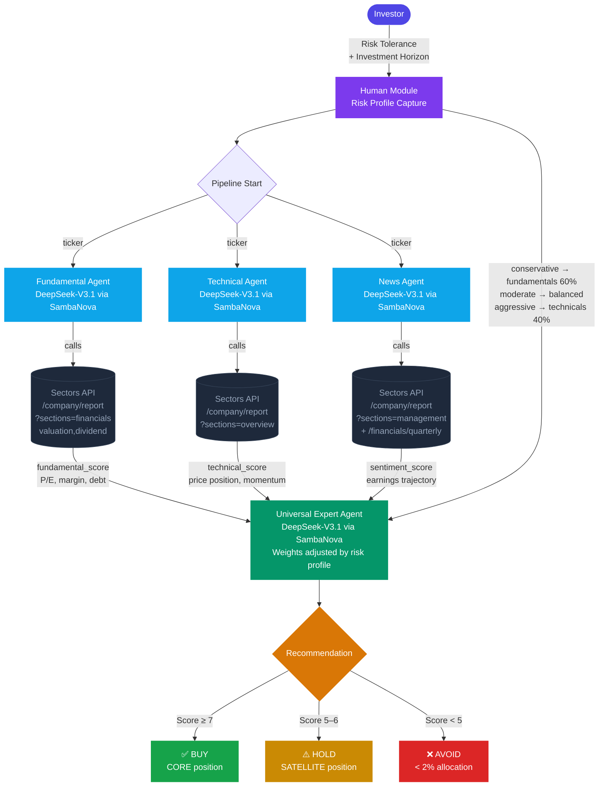

> Inspired by FinArena (Xu et al., 2025) — adapted for the Indonesia Stock Exchange using Sectors Financial API

## Overview

Most AI financial tools treat the investor as passive: you ask a question, the model answers. But real investment decisions are deeply personal — a retiree managing capital preservation thinks very differently from a growth-oriented analyst willing to tolerate volatility.

[FinArena](https://arxiv.org/abs/2503.02692) (Xu et al., 2025) proposes a different architecture: **Human-Agent Collaboration**. Instead of one generic AI answering all queries the same way, the system routes data through specialized agents, then synthesizes their findings through the lens of _your_ risk profile before producing a recommendation.

In this recipe, we adapt that architecture for the IDX using **Sectors Financial API** as the data backbone, with **SambaNova's DeepSeek-V3.1** serving as the LLM behind every agent. The result is a pipeline where:

- A **Fundamental Agent** retrieves financial statements and valuation metrics
- A **Technical Agent** retrieves recent price action and trading performance
- A **News Agent** fetches recent company news and filings
- A **Universal Expert Agent** synthesizes all three signals, weighted by your stated risk preference
- You, the human, stay in the loop by setting your risk profile upfront



## Why FinArena? What's Different from Existing Approaches

Before we write any code, it's worth understanding what problem this framework actually solves — and why previous approaches fell short.

### Problem 1: Existing tools use a single data type

Most AI stock analysis tools pick one lane: either they analyze price history (LSTM, ARIMA, transformer-based forecasters) _or_ they analyze news sentiment _or_ they read financial statements. Very few do all three, and even fewer do it in a coordinated way.

FinArena's response is **specialist agents** — each optimized for one data modality, then synthesized by a generalist. This is the same principle behind Mixture of Experts (MoE) models: a router decides which expert handles what, and each expert is highly tuned for its slice.

In our IDX adaptation, this maps naturally to Sectors API's endpoint structure: fundamentals, price performance, and news/filings are separate API calls, each handled by a dedicated agent.

### Problem 2: LLMs hallucinate on news data

This is the most technically interesting gap the paper addresses. When you ask a general LLM about recent corporate news, it may confidently generate plausible-sounding but fabricated events — especially for companies outside major markets like the US.

FinArena's solution is **Uncertainty-Driven Adaptive RAG** for the news agent. Unlike naive RAG that always retrieves external context, the adaptive version first checks whether the LLM is confident in its own knowledge — and only fetches additional information when uncertain. This reduces unnecessary retrieval calls and, more importantly, forces grounding on factual data when it matters most.

In our implementation, this translates to using Sectors API's actual filings and quarterly financials as the ground truth source, rather than relying on the LLM's training data.

### Problem 3: AI frameworks ignore the investor

This is FinArena's most distinctive critique of prior work. The paper calls it the _"Human-Machine confrontation"_ mindset — most research asks "can AI beat human experts?" and optimizes purely for prediction accuracy.

But accuracy on a benchmark is not the same as a good investment decision **for you**. A stock that's a strong BUY for an aggressive growth investor might be an AVOID for someone who can't stomach a 40% drawdown. Previous multi-agent frameworks produced the same recommendation for every user.

FinArena reframes the goal: instead of replacing the investor, the system **collaborates** with them. The human's risk preference isn't an afterthought appended to the output — it's injected into the Expert Agent's reasoning process, changing how it weights signals before producing a recommendation.

|  | Traditional AI Tools | FinArena Approach |
| --- | --- | --- |
| **Data** | Single modality (price OR news OR statements) | All three, via specialist agents |
| **Hallucination control** | None or static RAG | Adaptive RAG, only when uncertain |
| **Personalization** | One-size-fits-all output | Risk profile shapes the Expert Agent's reasoning |
| **Human role** | Passive recipient | Active collaborator who sets decision context |

---

## Prerequisites

Install dependencies:

```bash
!pip install requests nest_asyncio -q
```

Set your API keys. On Kaggle, use **Add-ons → Secrets** to store keys, then access them via `UserSecretsClient`. You'll need a [Sectors API key](https://sectors.app) and a [SambaNova API key](https://cloud.sambanova.ai):

```python
from kaggle_secrets import UserSecretsClient

secrets = UserSecretsClient()
SECTORS_API_KEY = secrets.get_secret("SECTORS_API_KEY")
SAMBANOVA_API_KEY = secrets.get_secret("SAMBANOVA_API_KEY")
```

## Step 1: Define the Sectors API Tools

We wrap three categories of Sectors API endpoints into tools — one per specialist agent — and expose them to SambaNova's DeepSeek-V3.1 model.

````python
import re
import json
import asyncio
import requests
import nest_asyncio

nest_asyncio.apply()

SECTORS_KEY = SECTORS_API_KEY
HEADERS = {"Authorization": SECTORS_KEY}
BASE = "https://api.sectors.app/v2"

SAMBANOVA_API_KEY = SAMBANOVA_API_KEY
SAMBANOVA_BASE_URL = "https://api.sambanova.ai/v1"
SAMBANOVA_MODEL_NAME = "DeepSeek-V3.1"

TOOL_SCHEMAS = {
    "get_fundamentals": {
        "type": "function",
        "function": {
            "name": "get_fundamentals",
            "description": "Fetch financial statements and valuation metrics for an IDX ticker.",
            "parameters": {
                "type": "object",
                "properties": {
                    "ticker": {"type": "string", "description": "Stock ticker (e.g., BBCA)"}
                },
                "required": ["ticker"]
            }
        }
    },
    "get_price_performance": {
        "type": "function",
        "function": {
            "name": "get_price_performance",
            "description": "Fetch recent price performance and trading statistics for an IDX ticker.",
            "parameters": {
                "type": "object",
                "properties": {
                    "ticker": {"type": "string", "description": "Stock ticker (e.g., BBCA)"}
                },
                "required": ["ticker"]
            }
        }
    },
    "get_news_and_filings": {
        "type": "function",
        "function": {
            "name": "get_news_and_filings",
            "description": "Fetch recent news and corporate filings for an IDX ticker.",
            "parameters": {
                "type": "object",
                "properties": {
                    "ticker": {"type": "string", "description": "Stock ticker (e.g., BBCA)"}
                },
                "required": ["ticker"]
            }
        }
    },
    "screen_by_sector": {
        "type": "function",
        "function": {
            "name": "screen_by_sector",
            "description": "Screen IDX companies by sector and minimum market cap (in billion IDR).",
            "parameters": {
                "type": "object",
                "properties": {
                    "sector": {"type": "string", "description": "Sector name (e.g., 'Basic Materials')"},
                    "min_market_cap_bn": {"type": "number", "description": "Minimum market cap in billion IDR"}
                },
                "required": ["sector", "min_market_cap_bn"]
            }
        }
    }
}

async def run_agent(system_instruction: str, prompt: str, tools: list = None) -> str:
    """Run a Sambanova agent with function calling and return text output."""
    tool_map = {fn.__name__: fn for fn in (tools or [])}
    llm_tools = [TOOL_SCHEMAS[func.__name__] for func in tools if func.__name__ in TOOL_SCHEMAS] if tools else []
    headers = {
        "Authorization": f"Bearer {SAMBANOVA_API_KEY}",
        "Content-Type": "application/json"
    }
    messages = [
        {"role": "system", "content": system_instruction},
        {"role": "user", "content": prompt}
    ]
    loop = asyncio.get_running_loop()

    for _ in range(10):
        payload = {
            "model": SAMBANOVA_MODEL_NAME,
            "messages": messages,
            "temperature": 0,
            "stream": False
        }

        if llm_tools:
            payload["tools"] = llm_tools
            payload["tool_choice"] = "auto"

        def _sync_request():
            try:
                response = requests.post(f"{SAMBANOVA_BASE_URL}/chat/completions", headers=headers, json=payload)
                response.raise_for_status()
                return response.json()
            except requests.exceptions.RequestException as e:

                print(f"Error during Sambanova API call: {e}")
                if e.response is not None:
                    print(f"Response Status: {e.response.status_code}")
                    print(f"Response Body: {e.response.text}")
                raise

        try:
            llm_response = await loop.run_in_executor(None, _sync_request)
        except Exception as e:
            return f"Error communicating with Sambanova API: {e}"

        if not llm_response or not llm_response.get('choices'):
            return f"Invalid or empty response from Sambanova: {llm_response}"

        first_choice = llm_response['choices'][0]
        message = first_choice.get('message', {})

        # Check whether the model wants to call a function
        tool_calls = message.get('tool_calls')

        if not tool_calls:
            return message.get('content', '') # Model is done — return the final answer

        # Append the model's tool-call turn to the conversation history
        messages.append(message)

        # Run each tool and collect the results
        tool_outputs = []
        for tc in tool_calls:
            function_name = tc['function']['name']
            function_args = json.loads(tc['function']['arguments'])
            
            if function_name in tool_map:
                try:
                    result = tool_map[function_name](**function_args)
                    tool_outputs.append({
                        "tool_call_id": tc['id'],
                        "role": "tool",
                        "name": function_name,
                        "content": result
                    })
                except Exception as e:
                    tool_outputs.append({
                        "tool_call_id": tc['id'],
                        "role": "tool",
                        "name": function_name,
                        "content": f"Error executing tool {function_name}: {e}"
                    })
            else:
                tool_outputs.append({
                    "tool_call_id": tc['id'],
                    "role": "tool",
                    "name": function_name,
                    "content": f"Error: Tool {function_name} not found."
                })
        
        # Append the tool results back into the conversation
        messages.extend(tool_outputs)

    # Fallback if the maximum number of rounds is reached
    return messages[-1].get('content', 'Max tool call rounds reached without final answer.')

def parse_json_response(text: str) -> dict:
    """Strip markdown code fences from LLM output, then parse as JSON.
    LLMs often wrap JSON output in ```json ... ``` blocks."""
    if not text:
        raise ValueError("Empty response from model")
    # Remove opening ```json or ``` fence
    clean = re.sub(r"^```(?:json)?\s*", "", text.strip(), flags=re.IGNORECASE)
    # Remove closing ``` fence
    clean = re.sub(r"\s*```$", "", clean.strip())
    return json.loads(clean.strip())

# --- Tool 1: Fundamental data (financials + valuation) --- 
def get_fundamentals(ticker: str) -> str:
    """Fetch financial statements and valuation metrics for an IDX ticker."""
    url = f"{BASE}/company/report/{ticker}/?sections=financials,valuation,dividend"
    resp = requests.get(url, headers=HEADERS)
    resp.raise_for_status()
    return json.dumps(resp.json())

# --- Tool 2: Technical / price data --- 
def get_price_performance(ticker: str) -> str:
    """Fetch recent price performance and trading statistics for an IDX ticker."""
    url = f"{BASE}/company/report/{ticker}/?sections=overview"
    resp = requests.get(url, headers=HEADERS)
    resp.raise_for_status()
    return json.dumps(resp.json())

# --- Tool 3: News and recent filings --- 
def get_news_and_filings(ticker: str) -> str:
    """Fetch recent news and corporate filings for an IDX ticker."""
    url = f"{BASE}/company/report/{ticker}/?sections=management"
    resp = requests.get(url, headers=HEADERS)
    resp.raise_for_status()

    # Also pull quarterly financials for recent context
    url_q = f"{BASE}/financials/quarterly/{ticker}/?n_quarters=4"
    resp_q = requests.get(url_q, headers=HEADERS)

    result = {
        "management": resp.json(),
        "quarterly_financials": resp_q.json() if resp_q.ok else {}
    }
    return json.dumps(result)
````

## Step 2: The Human Module — Capturing Risk Preference

This is what differentiates Human-Agent Collaboration from a standard chatbot. Before any agents run, we ask the investor to declare their risk profile. This preference will be injected into the Universal Expert Agent's prompt, shaping how it weighs signals.

```python
def get_risk_profile() -> dict:
    """Interactively capture the investor's risk preference."""
    print("\n=== FinArena: IDX Investment Analysis ===")
    print("Before we begin, tell us about your investment profile.\n")

    print("Risk Tolerance:")
    print("  [1] Conservative — Capital preservation, low volatility, prefer dividends")
    print("  [2] Moderate     — Balanced growth and income, some volatility acceptable")
    print("  [3] Aggressive   — Maximum growth, high volatility acceptable\n")

    choice = input("Enter your risk tolerance (1/2/3): ").strip()
    risk_map = {"1": "conservative", "2": "moderate", "3": "aggressive"}
    risk = risk_map.get(choice, "moderate")

    horizon = input("Investment horizon in years (e.g. 1, 3, 5, 10): ").strip()

    print(f"\nProfile set: {risk.upper()} investor, {horizon}-year horizon.\n")
    return {"risk_tolerance": risk, "horizon_years": horizon}
```

**Example interaction:**

```text
=== FinArena: IDX Investment Analysis ===
Before we begin, tell us about your investment profile.

Risk Tolerance:
  [1] Conservative — Capital preservation, low volatility, prefer dividends
  [2] Moderate     — Balanced growth and income, some volatility acceptable
  [3] Aggressive   — Maximum growth, high volatility acceptable

Enter your risk tolerance (1/2/3): 1
Investment horizon in years (e.g. 1, 3, 5, 10): 5

Profile set: CONSERVATIVE investor, 5-year horizon.
```

## Step 3: The Three Specialist Agents

Each agent has a narrow mandate and a single tool. Narrow focus reduces hallucinations and keeps reasoning traceable. All three run on SambaNova's DeepSeek-V3.1 with function calling enabled.

```python
FUNDAMENTAL_INSTRUCTIONS = (
    "You are a fundamental equity analyst specializing in the Indonesia Stock Exchange (IDX). "
    "Use the get_fundamentals tool to retrieve financial data for the given ticker. "
    "Summarize: revenue trend, net profit margin, P/E ratio, P/B ratio, dividend yield, "
    "and debt-to-equity. Flag any red flags (negative margins, high leverage, etc). "
    "Output a JSON object with keys: ticker, revenue_trend, profitability, valuation, "
    "dividend_yield, leverage, red_flags, fundamental_score (1-10)."
)

TECHNICAL_INSTRUCTIONS = (
    "You are a technical analyst specializing in IDX price action. "
    "Use get_price_performance to retrieve price and market data for the given ticker. "
    "Analyze: 52-week price range position, market cap trend, beta (if available), "
    "and recent trading momentum. "
    "Output a JSON object with keys: ticker, price_position, momentum, market_cap, "
    "volatility_signal, technical_score (1-10)."
)

NEWS_INSTRUCTIONS = (
    "You are a news and sentiment analyst for IDX equities. "
    "Use get_news_and_filings to retrieve recent management info and quarterly financials. "
    "Look for: earnings trajectory (last 4 quarters), management changes, and any notable "
    "corporate actions. Assess whether momentum is positive, neutral, or negative. "
    "Output a JSON object with keys: ticker, earnings_trajectory, management_notes, "
    "corporate_actions, sentiment (positive/neutral/negative), sentiment_score (1-10)."
)
```

## Step 4: The Universal Expert Agent

This is the synthesis layer — the agent that reads all three specialist reports alongside the investor's risk profile and produces a final, personalized recommendation. This mirrors FinArena's "universal expert agent" that combines multimodal signals with user preferences.

```python
def build_expert_instructions(risk_profile: dict) -> str:
    risk = risk_profile["risk_tolerance"]
    horizon = risk_profile["horizon_years"]

    # Risk-specific weighting instructions
    weight_instructions = {
        "conservative": (
            "Weight fundamentals (60%) > sentiment (25%) > technicals (15%). "
            "Prioritize dividend yield, low debt, and stable earnings over growth. "
            "Downgrade any stock with a fundamental_score below 6 or negative sentiment."
        ),
        "moderate": (
            "Weight fundamentals (40%) > technicals (35%) > sentiment (25%). "
            "Balance growth and income. Accept moderate volatility if fundamentals are strong."
        ),
        "aggressive": (
            "Weight technicals (40%) > fundamentals (35%) > sentiment (25%). "
            "Prioritize momentum and growth potential. Higher risk is acceptable for higher return."
        ),
    }

    return (
        f"You are a senior investment advisor synthesizing research for a {risk.upper()} investor "
        f"with a {horizon}-year horizon on the Indonesia Stock Exchange (IDX).\n\n"
        f"Weighting framework for this investor profile:\n{weight_instructions[risk]}\n\n"
        "You will receive three JSON reports: fundamental, technical, and sentiment analysis. "
        "Combine them into a final investment recommendation with:\n"
        "- Overall score (1-10)\n"
        "- Recommendation: BUY / HOLD / AVOID\n"
        "- Key reasons (3 bullet points)\n"
        "- Risk warnings specific to this investor's profile\n"
        "- Suggested position sizing: CORE (>5%), SATELLITE (2-5%), or AVOID (<2%)\n\n"
        "Format your output as clean JSON with keys: ticker, overall_score, recommendation, "
        "key_reasons, risk_warnings, position_sizing, summary."
    )
```

## Step 5: Orchestrate the Full Pipeline

Now we wire everything together. The pipeline is sequential: the three specialist agents run in parallel (conceptually), then the expert synthesizes their output.

```python
async def analyze_stock(ticker: str, risk_profile: dict) -> dict:
    """Run the full FinArena pipeline for a single IDX ticker."""
    print(f"\nAnalyzing {ticker}...")

    # Run the three specialist agents concurrently
    fundamental_task = run_agent(
        FUNDAMENTAL_INSTRUCTIONS, f"Analyze ticker: {ticker}", [get_fundamentals]
    )
    technical_task = run_agent(
        TECHNICAL_INSTRUCTIONS, f"Analyze ticker: {ticker}", [get_price_performance]
    )
    news_task = run_agent(
        NEWS_INSTRUCTIONS, f"Analyze ticker: {ticker}", [get_news_and_filings]
    )

    fundamental_result, technical_result, news_result = await asyncio.gather(
        fundamental_task, technical_task, news_task
    )

    print(f"  Fundamental: done | Technical: done | News: done")

    # Synthesize with the Universal Expert Agent
    expert_instructions = build_expert_instructions(risk_profile)
    synthesis_prompt = (
        f"Ticker: {ticker}\n\n"
        f"=== FUNDAMENTAL REPORT ===\n{fundamental_result}\n\n"
        f"=== TECHNICAL REPORT ===\n{technical_result}\n\n"
        f"=== NEWS & SENTIMENT REPORT ===\n{news_result}\n\n"
        "Synthesize these three reports into your final recommendation."
    )

    expert_result = await run_agent(expert_instructions, synthesis_prompt)
    return parse_json_response(expert_result)


RECOMMENDATION_EMOJI = {"BUY": "✅", "HOLD": "⚠️", "AVOID": "❌"}

async def main():
    import pandas as pd
    from IPython.display import display

    # Step 1: Capture human input
    risk_profile = get_risk_profile()

    # Step 2: Define your watchlist
    watchlist = ["BBCA", "TLKM", "ASII"]

    # Step 3: Analyze each stock
    recommendations = []
    for ticker in watchlist:
        result = await analyze_stock(ticker, risk_profile)
        recommendations.append(result)

    # Step 4: Display as table
    sorted_recs = sorted(recommendations, key=lambda x: x["overall_score"], reverse=True)

    rows = []
    for rec in sorted_recs:
        emoji = RECOMMENDATION_EMOJI.get(rec["recommendation"], "")
        reasons = "\n".join(f"• {r}" for r in rec["key_reasons"])
        rows.append({
            "Ticker":         rec["ticker"],
            "Score":          f"{rec['overall_score']}/10",
            "Recommendation": f"{emoji} {rec['recommendation']}",
            "Position":       rec["position_sizing"],
            "Key Reasons":    reasons,
            "Risk Warnings":  rec["risk_warnings"],
        })

    df = pd.DataFrame(rows)

    print(f"\nFinArena Analysis — {risk_profile['risk_tolerance'].upper()} Investor "
          f"| Horizon: {risk_profile['horizon_years']} years\n")

    # Wrap long text columns for readability
    pd.set_option("display.max_colwidth", 80)
    pd.set_option("display.colheader_justify", "left")
    display(df.set_index("Ticker"))

    return recommendations


# Kaggle / Jupyter: use await directly (event loop already running)
await main()
```

## Sample Output

For a **Conservative investor** analyzing BBCA, TLKM, and ASII, the output renders as a pandas DataFrame table in Kaggle:

```text
=== FinArena: IDX Investment Analysis ===
Before we begin, tell us about your investment profile.

Risk Tolerance:
  [1] Conservative — Capital preservation, low volatility, prefer dividends
  [2] Moderate     — Balanced growth and income, some volatility acceptable
  [3] Aggressive   — Maximum growth, high volatility acceptable

Enter your risk tolerance (1/2/3):  1
Investment horizon in years (e.g. 1, 3, 5, 10):  1

Profile set: CONSERVATIVE investor, 1-year horizon.


Analyzing BBCA...
  Fundamental: done | Technical: done | News: done

Analyzing TLKM...
  Fundamental: done | Technical: done | News: done

Analyzing ASII...
  Fundamental: done | Technical: done | News: done

FinArena Analysis — CONSERVATIVE Investor | Horizon: 1 years
```

<Frame>
  
</Frame>

```text
[{'ticker': 'BBCA',
  'overall_score': 8,
  'recommendation': 'BUY',
  'key_reasons': ['Exceptional fundamental strength with 51.4% net profit margin, 20.4% ROE, and conservative leverage (debt-to-equity 4.6x) supporting stable dividend yield of 5.5%',
   "Strong market leadership position as Indonesia's largest bank by market cap with consistent revenue growth and robust capital adequacy ratio of 30.4%",
   'Positive earnings trajectory and stable management team with strong operating cash flow generation and asset growth'],
  'risk_warnings': ['Premium valuation (P/B 3.0x vs peer avg 0.75x) may limit upside potential in conservative portfolio context',
   'Loan-to-deposit ratio of 75.9% approaching regulatory limits requires monitoring',
   'Moderate volatility and mid-range price position (56.8% of 52-week range) may not suit ultra-conservative short-term horizon'],
  'position_sizing': 'CORE',
  'summary': 'BBCA represents a high-quality conservative investment with strong fundamentals, attractive dividend yield, and market leadership position. While trading at a premium valuation, its exceptional profitability, conservative leverage, and stable earnings make it suitable for core portfolio allocation despite some monitoring requirements on lending ratios.'},
 {'ticker': 'TLKM',
  'overall_score': 6,
  'recommendation': 'HOLD',
  'key_reasons': ['Attractive 7.3% dividend yield with strong historical payout consistency, meeting conservative income requirements',
   'Reasonable valuation at P/E 15.6x and P/B 1.9x, trading below historical and peer averages despite current weakness',
   'Stable revenue base and strong cash flow generation (IDR 14.2T-17.2T) supporting ongoing operations and dividend sustainability'],
  'risk_warnings': ['Significant technical weakness with stock near 52-week lows (-35% from highs) and bearish momentum, creating near-term price risk',
   'Declining profitability metrics with negative EPS growth (-24.7% YoY) and shrinking margins, potentially impacting future dividends',
   'High volatility and mixed earnings trajectory may not suit conservative investors seeking stable returns'],
  'position_sizing': 'SATELLITE',
  'summary': 'TLKM offers attractive dividend yield and reasonable valuation for income-focused investors, but faces significant headwinds from declining profitability and technical weakness. The stable cash flow generation and moderate leverage provide some downside protection, but the combination of fundamental deterioration and poor technical positioning makes it unsuitable for core holdings. Conservative investors should maintain only a satellite position (2-5%) while monitoring margin stabilization and technical recovery.'},
 {'ticker': 'ASII',
  'overall_score': 6.5,
  'recommendation': 'HOLD',
  'key_reasons': ['Excellent 8.18% dividend yield with sustainable payout ratio (49.7%) aligns with conservative income objectives',
   'Attractive valuation metrics with P/E of 6.15x and P/B of 0.84x, trading below peer averages',
   'Strong balance sheet with manageable debt (0.74x debt-to-equity) and solid interest coverage (14.2x)'],
  'risk_warnings': ['Recent revenue decline (-5.6% YoY) and significant Q1 2026 earnings drop raise concerns about near-term performance stability',
   'Negative cash flow to debt ratio (-0.39x) and negative free cash flow could impact dividend sustainability if prolonged',
   'Mixed earnings trajectory and minimal insider ownership (0.0001-0.0002%) may indicate limited management alignment with shareholders'],
  'position_sizing': 'SATELLITE',
  'summary': 'ASII offers compelling dividend yield and valuation for conservative investors, but recent earnings weakness and cash flow concerns warrant caution. The stock is suitable for a satellite position (2-5%) given its strong fundamentals offset by near-term headwinds and neutral sentiment.'}]
```

## Extending the Framework

If you want to extract the result on Excel format, you can run this code:

```python
print("Converting analysis results to Excel...")

import pandas as pd

try:
    if 'all_recommendations' in locals() or 'all_recommendations' in globals():
        current_recommendations = all_recommendations
    else:
        print("\n--- Re-running the analysis to get Excel data ---")
        current_recommendations = await main()

    rows_for_excel = []
    RECOMMENDATION_EMOJI = {"BUY": "✅", "HOLD": "⚠️", "AVOID": "❌"}

    for rec in current_recommendations:
        emoji = RECOMMENDATION_EMOJI.get(rec["recommendation"], "")
        reasons = "\n".join(f"• {r}" for r in rec["key_reasons"])
        rows_for_excel.append({
            "Ticker":         rec["ticker"],
            "Score":          f"{rec['overall_score']}/10",
            "Recommendation": f"{emoji} {rec['recommendation']}",
            "Position":       rec["position_sizing"],
            "Key Reasons":    reasons,
            "Risk Warnings":  rec["risk_warnings"],
            "Summary":        rec.get("summary", "") 
        })

    df_excel = pd.DataFrame(rows_for_excel)
    excel_filename = "investment_recommendations.xlsx"
    df_excel.to_excel(excel_filename, index=False)

    print(f"\nAnalysis results successfully saved to '{excel_filename}'")

except NameError:
    print("\nError: Variable 'all_recommendations' not found.")
    print("Please re-run cell `rH3LeogMJ_RP` after changing its last line to `all_recommendations = await main()`,")
    print("or make sure the output of `main()` is saved to an accessible variable.")
except Exception as e:
    print(f"An error occurred while processing or saving to Excel: {e}")
```

## Summary

In this recipe, we adapted the FinArena Human-Agent Collaboration framework for the Indonesia Stock Exchange, powered by Sectors Financial API and SambaNova's DeepSeek-V3.1 model. The key design decisions:

- **Human-in-the-loop upfront**: Risk preference shapes how the Expert Agent weights signals — the same stock gets a different recommendation for a conservative vs. aggressive investor.
- **Specialist agents, not one mega-prompt**: Three focused agents (Fundamental, Technical, News) each do one job well, reducing hallucinations and making the reasoning auditable.
- **Sectors API as the data backbone**: All financial data — from valuations to quarterly earnings to price performance — flows from Sectors' IDX-specific endpoints, ensuring the analysis is grounded in real, current data rather than the LLM's training set.

The architecture is intentionally modular: swap out any specialist agent, add new data sources from Sectors API (dividends, free float, subsector reports), or plug in a different LLM — the pipeline adapts without a rewrite.

---

_Based on: Xu, C., Liu, Z., & Li, Z. (2025). [FinArena: A Human-Agent Collaboration Framework for Financial Market Analysis and Forecasting](https://arxiv.org/abs/2503.02692). arXiv:2503.02692._