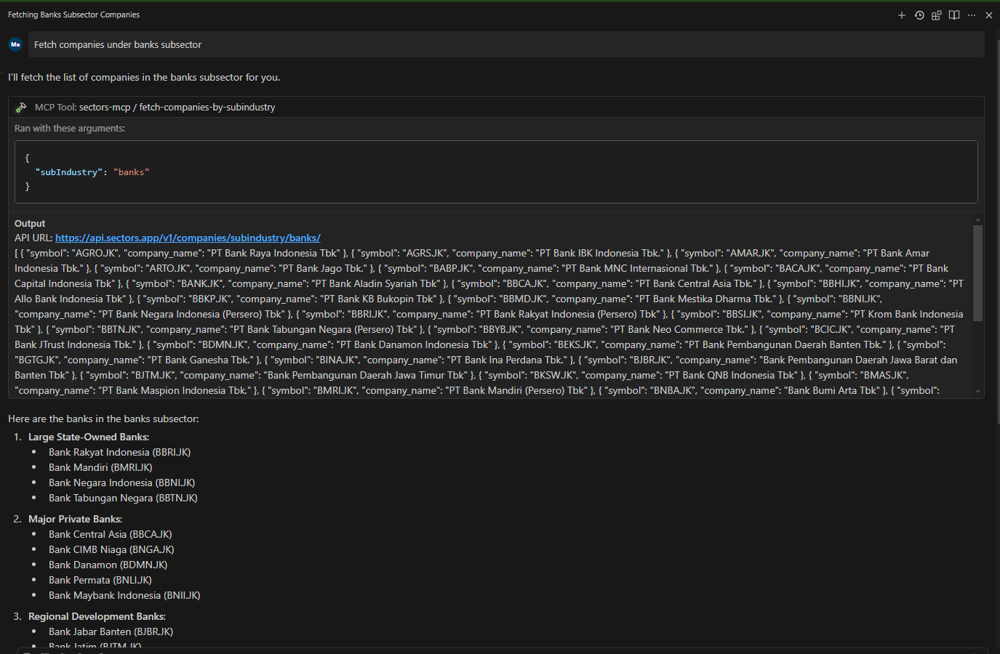
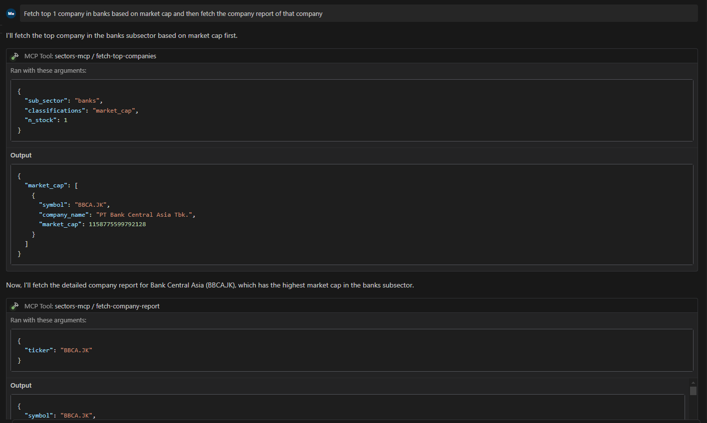

Welcome to the Sectors MCP Server\! This guide will help you understand what this server offers, why it's a valuable tool, and how you can start using it to access comprehensive financial market data and analysis.

## **What is the Sectors MCP Server?**

The Sectors MCP Server is a powerful tool built on the Model Context Protocol (MCP). It's designed to provide you with a wide array of financial market data and analysis capabilities integrated with Sectors API, which help you to easily access:

- Stock market sectors
- Market indices
- Detailed company information

Whether you're an analyst, developer, or financial enthusiast, this server offers a structured way to access and work with financial data provided by Sectors API.

## **Why Use the Sectors MCP Server? (The Pros)**

Leveraging the Sectors MCP Server offers several key advantages:

- **Comprehensive Data Access:** Gain access to a rich dataset including:
  - **Market Indices:** Historical and daily data for various stock market indices.
  - **In-Depth Company Info:** Detailed reports, financial statements, and performance metrics for companies.
  - **Sector & Industry Insights:** Tools to analyze companies based on their sector, subsector, and industry.
  - **Specialized SGX Data:** Dedicated tools for companies listed on the Singapore Exchange (SGX).
  - **Market Analysis Tools:** Identify top market movers, most traded stocks, and high-growth companies.
  - **Financial Reporting:** Easily retrieve quarterly financial data and reporting schedules.
- **Standardized Protocol (MCP):** Being an MCP server means it can be used with any MCP-compatible client. This promotes interoperability and allows you to integrate it into various workflows and applications.
- **Structured Toolset:** The server provides a clear set of defined "tools" (functions) that you can call to retrieve specific data. This makes it easy to automate data collection and analysis tasks.
- **Focused Analysis:** The emphasis on sectors and industries allows for targeted research and comparison, helping you understand market trends and company positioning.
- **Extensible:** The server is designed with developers in mind, offering a clear structure for adding new tools and functionalities.

## **Getting Started**

Before you can utilize the server, you'll need to set it up.

### **Prerequisites:**

- Node.js (version 14 or later)
- npm (Node Package Manager, usually comes with Node.js)
- You need a Sectors API Key to use this server. You can get it from [Sectors API](https://sectors.app/api).

### **Installation Steps:**

1. Clone the Repository:  
   If you haven't already, get the server's source code here: [https://github.com/supertypeai/sectors-mcp.git](https://github.com/supertypeai/sectors-mcp.git). Or directly use git clone command.
   ```bash
   git clone https://github.com/supertypeai/sectors-mcp.git
   ```
2. Install Dependencies:  
   Navigate to the cloned directory in your terminal and run:

   ```bash
   cd sectors-mcp
   npm install
   ```

   This command downloads and installs all the necessary packages the server relies on.

3. Build the Project:  
   After the dependencies are installed, build the server by running:

   ```bash
   npm run build
   ```

   This compiles the TypeScript code into JavaScript that can be run by Node.js.

### **Configuration:**

The server requires API credentials to access its data sources. You can fill the API Key in the MCP config file in the command line. Or if you want to extend the use of this MCP and test it with other tools, you can fill the API Key in the .env file.

_**Note:**_ If you fill the API Key in the MCP config file, you can skip the .env file.

### For MCP Client that use MCP config file

You can find the MCP config file for your MCP client in the MCP client's documentation. In this tutorial we use [Windsurf MCP Client](https://codeium.com/windsurf/mcp). You can find the MCP config file in the .codeium\windsurf\mcp_config.json file.

Write this into your MCP config file:

```json
{
  "mcpServers": {
    "sectors-mcp": {
      "command": "node",
      "args": ["Path\toyourproject\buildindex.js"],
      "env": {
        "SECTORS_API_KEY": "your_api_key"
      }
    }
  }
}
```

### For MCP Client that use .env file

1. Create a file named .env in the root directory of the project.
2. Add the following lines to this .env file, replacing your_api_base_url and your_api_key with the actual credentials:

```bash
SECTORS_API_BASE=your_api_base_url
SECTORS_API_KEY=your_api_key
```

### **Interacting with an MCP Client:**

Now you can interact with the Sectors API in your MCP Client. All the examples provided is using Windsurf Code Editor. But it should work the same for other MCP Clients.

Let's try some prompt as examples:

**1. Fetch Companies Under Banks Subsector**



You can see that Windsurf call the fetch-companies-by-subsector tool with the subsector name "banks" and return the response in a chat message.

**2. Multiple Tools in a Prompt**



You can see that Windsurf call multiple tools in a prompt. It call the fetch-top-companies based on Banks subsector and then it call the fetch-company-report for the company in the list.

### **Available Tools:**

The server offers a variety of tools to fetch specific financial data. Here's a categorized list:

**Market Indices:**

- fetch-index: Get data for a specific market index.
- fetch-index-daily: Retrieve daily transaction data for an index.
- fetch-idx-market-cap: Access historical market capitalization data for an index.

**Company Data:**

- fetch-company-report: Obtain detailed company reports (e.g., overview, financials).
- fetch-company-segments: Access data about a company's different business segments.
- fetch-listing-performance: View performance metrics since a company's listing.
- fetch-quarterly-financials: Get quarterly financial statements.
- fetch-quarterly-financial-dates: Find out reporting dates for quarterly financials.
- fetch-sgx-company-report: Specialized reports for companies listed on the Singapore Exchange (SGX).

**Sector & Industry Analysis:**

- get-subsectors: List all available subsectors for analysis.
- fetch-subindustries: Get data related to specific subindustries.
- fetch-industries: Access information about various industries.
- fetch-companies-by-subsector: Find companies belonging to a particular subsector.
- fetch-companies-by-subindustry: Find companies within a specific subindustry.
- fetch-companies-by-index: Get a list of companies included in a specific market index.
- fetch-sgx-companies-by-sector: Find SGX-listed companies categorized by their sector.

**Market Analysis:**

- fetch-top-companies: Identify top companies based on various metrics.
- fetch-top-company-movers: Discover stocks with the biggest gains or losses.
- fetch-top-growth-companies: Find companies exhibiting the highest growth metrics.
- fetch-most-traded-stocks: Get a list of the most actively traded stocks.

## **Key Features Summary**

- **Comprehensive Financial Data:** From market indices to granular company details.
- **MCP Standard:** Ensures compatibility and ease of integration.
- **Targeted Analysis:** Powerful tools for sector, industry, and specific market analysis.

This guide should provide a solid starting point for users looking to harness the capabilities of your Sectors MCP Server. For developers looking to contribute or add new tools, please join our Discord server.
