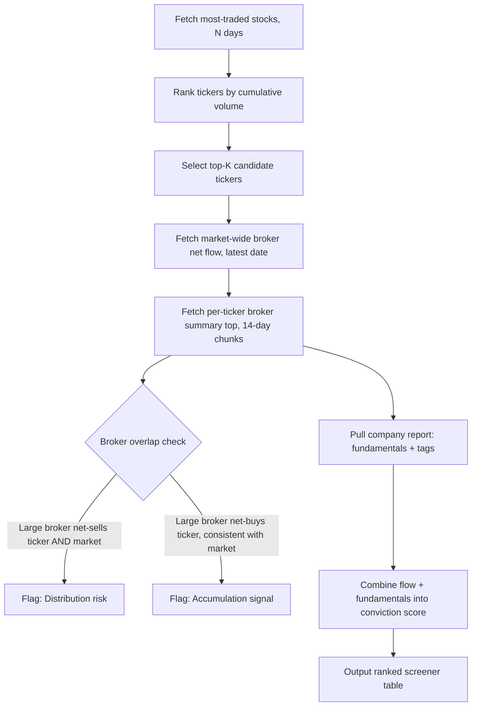

## Summary

Retail-heavy IDX tickers can post enormous daily volume while giving no clue about who is actually driving the tape. This tutorial builds a repeatable Python workflow using the Sectors API v2 that pulls the most-traded stocks over a window, cross-references broker-level net flow for the busiest name, and flags whether large brokers are net accumulating or distributing. The output is a ranked "broker conviction" table you can rerun every trading day. This version runs entirely in Google Colab, no local Python setup required.

Who it's for: quantitative analysts, data analysts, and serious retail investors who want a systematic, data-driven read on order flow rather than eyeballing price charts. Expected outcome: a Colab notebook that, given any IDX ticker, returns its top accumulating and distributing brokers over a chosen date range, plus a screener that surfaces which of the day's most-traded stocks show the clearest institutional footprint.

## Why This Matters

Volume alone is a weak signal. A stock can trade billions of shares purely on retail churn with no net directional conviction. Broker-level net flow data solves this by decomposing volume into who bought and who sold. When a small set of brokers dominates one side of the flow (heavy net buying concentrated in 2 to 3 codes) while volume stays elevated, that is a materially different situation than the same volume spread evenly with no net bias.

This matters for three concrete use cases. First, risk management: spotting when a position you hold is being quietly distributed by a large broker even as the price holds up. Second, idea generation: surfacing accumulation patterns in speculative, high-volume names before they show up in fundamentals. Third, research documentation: producing an auditable, data-backed rationale for a trade thesis instead of a subjective chart read.

## Prerequisites

| Requirement | Details |
| --- | --- |
| Sectors API key | Sign up at sectors.app and generate a v2 API key from your dashboard. Note that v1 was fully discontinued on 2026-05-12; all requests must target `/v2/` |
| Environment | Google Colab (colab.research.google.com), no local install needed — `requests` and `pandas` are preinstalled |
| Colab Secrets access | Store your API key using Colab's built-in Secrets manager (🔑 icon in the left sidebar) instead of a local `.env` file |
| API credits | `most-traded` and `brokers/top` cost 2 credits per call, `broker-summary/{symbol}/top` costs 2 credits per call, `company/report` costs 1 credit per requested section |
| IDX ticker knowledge | Basic familiarity with 4-letter IDX symbols (e.g. `BBCA`, `BUMI`) |
| Broker code reference | Pull the `/v2/brokers/` registry once to map 2-letter codes (e.g. `CC`, `YP`) to member names, origin, and cohort |

## Step-by-Step Guide

### Step 0: Set up your API key with Colab Secrets

Before anything else, store the key so it never gets pasted in plain text inside the notebook.

1. Click the key icon (🔑) in the left sidebar of your Colab notebook.
2. Click **Add new secret**. Name it `SECTORS_API_KEY` and paste your API key as the value.
3. Toggle **Notebook access** to ON for this notebook.
4. Run the cell below to load it into the session.

```python
import requests
import pandas as pd
from google.colab import userdata

API_KEY = userdata.get("SECTORS_API_KEY")
BASE_URL = "https://api.sectors.app/v2"
HEADERS = {"Authorization": API_KEY}
```

This replaces the local `os.environ["SECTORS_API_KEY"]` pattern from a script running on your own machine. Colab runs on a separate VM, so a local shell export never reaches it, and `os.environ` alone will raise a `KeyError` there. `userdata.get()` is the Colab-native equivalent: it reads the secret directly from the notebook's secure secret store, and the value never has to be typed or committed anywhere.

If you ever see `SecretNotFoundError` instead, it means the secret name doesn't match exactly, or notebook access wasn't enabled in step 3 above, re-check the key icon panel.

### Step 1: Identify the most-traded stock over your window

Now pull the most-traded IDX stocks over the last several weeks using the `GET /v2/most-traded/` endpoint. This tells you where the volume, and therefore the flow story, actually is.

```python
def fetch_most_traded(start: str, end: str, n_stock: int = 5) -> pd.DataFrame:
    """Fetch most-traded IDX stocks by volume, keyed by date.

    Endpoint: GET /v2/most-traded/
    """
    resp = requests.get(
        f"{BASE_URL}/most-traded/",
        params={"start": start, "end": end, "n_stock": n_stock},
        headers=HEADERS,
    )
    resp.raise_for_status()
    data = resp.json()
    rows = [
        {"date": date, **stock}
        for date, stocks in data.items()
        for stock in stocks
    ]
    return pd.DataFrame(rows)

df = fetch_most_traded("2026-07-04", "2026-08-01", n_stock=5)
print(df.groupby("symbol")["volume"].sum().sort_values(ascending=False).head())
```

Running this over July 4 to August 1, 2026 on IDX produced the following daily leaders (sample of the pulled data):

| Date | #1 Symbol | Volume | Price (IDR) |
| --- | --- | --- | --- |
| 2026-07-06 | BUMI.JK | 1,769,220,200 | 141 |
| 2026-07-14 | BUMI.JK | 3,456,209,000 | 149 |
| 2026-07-21 | BUMI.JK | 5,815,015,800 | 168 |
| 2026-07-23 | BUMI.JK | 12,064,567,200 | 183 |
| 2026-07-31 | BUMI.JK | 2,318,947,200 | 165 |

`BUMI.JK` (Bumi Resources Tbk) held the #1 slot on nearly every trading day in the window, peaking at over 12 billion shares traded on July 23 alone, a clear candidate for a broker-flow deep dive. `BNBR.JK` (Bakrie & Brothers) was the consistent runner-up, both names sharing the same corporate group affiliation, which is itself worth noting when assessing correlated flow.

### Step 2: Pull market-wide broker net flow for context

Before drilling into a single ticker, check which brokers are net buyers or net sellers across the whole market on your target date, using `GET /v2/brokers/top/`. This gives you a baseline for whether a broker's activity on your stock is unusual or just part of a broad market posture.

```python
def fetch_top_brokers(date: str, metric: str = "net", n_brokers: int = 10) -> pd.DataFrame:
    """Fetch brokers ranked by gross trade value or net flow for one date.

    Endpoint: GET /v2/brokers/top/
    """
    resp = requests.get(
        f"{BASE_URL}/brokers/top/",
        params={"date": date, "metric": metric, "n_brokers": n_brokers},
        headers=HEADERS,
    )
    resp.raise_for_status()
    return pd.DataFrame(resp.json()["results"])

market_flow = fetch_top_brokers("2026-07-31", metric="net", n_brokers=10)
print(market_flow)
```

Market-wide net flow for July 31, 2026:

| Rank | Broker | Gross (IDR) | Net (IDR) |
| --- | --- | --- | --- |
| 1 | DX | 379,594,475,200 | \+224,201,192,800 |
| 2 | CC | 2,710,270,031,800 | -148,766,382,600 |
| 3 | BK | 1,008,748,851,100 | \+127,527,908,100 |
| 4 | KZ | 447,722,875,000 | -118,645,286,600 |
| 5 | SQ | 623,106,777,500 | -100,277,739,700 |
| 6 | YP | 1,435,359,970,000 | \+98,231,527,200 |
| 7 | AK | 2,350,830,617,200 | \+86,270,419,200 |
| 8 | IF | 144,884,092,700 | \+77,022,179,100 |
| 9 | BB | 465,106,622,100 | -73,090,905,500 |
| 10 | LG | 452,187,570,300 | \+62,097,019,900 |

`CC` stands out: it has the second-highest gross trade value in the market (IDR 2.71 trillion) but a large negative net (-IDR 148.8 billion), meaning it is trading enormous volume while net distributing. That is the profile worth checking against individual tickers.

### Step 3: Pull broker-level net flow for the target ticker

Now narrow to the ticker itself and pull which brokers accumulated (net bought) and which distributed (net sold) over the same window, using `GET /v2/broker-summary/{symbol}/top/`. Note that `symbol` is a path parameter here, not a query parameter.

```python
def fetch_broker_summary_top(symbol: str, start: str, end: str, n_brokers: int = 5) -> dict:
    """Top accumulating and distributing brokers for a single IDX ticker.

    Endpoint: GET /v2/broker-summary/{symbol}/top/
    """
    resp = requests.get(
        f"{BASE_URL}/broker-summary/{symbol}/top/",
        params={"start": start, "end": end, "n_brokers": n_brokers},
        headers=HEADERS,
    )
    resp.raise_for_status()
    return resp.json()

bumi_flow = fetch_broker_summary_top("BUMI", "2026-07-04", "2026-07-31", n_brokers=5)
buyers = pd.DataFrame(bumi_flow["top_buyers"])
sellers = pd.DataFrame(bumi_flow["top_sellers"])
```

Results for `BUMI.JK`, July 4 to 31, 2026:

**Top accumulating brokers**

| Rank | Broker | Net (IDR) | Buy (IDR) | Sell (IDR) |
| --- | --- | --- | --- | --- |
| 1 | CP | \+74,800,665,900 | 720,994,554,200 | 646,193,888,300 |
| 2 | LG | \+60,397,860,300 | 212,327,027,300 | 151,929,167,000 |
| 3 | YU | \+43,235,173,200 | 398,907,427,000 | 355,672,253,800 |
| 4 | SS | \+34,737,779,200 | 73,115,749,200 | 38,377,970,000 |
| 5 | MG | \+34,664,594,100 | 913,678,997,400 | 879,014,403,300 |

**Top distributing brokers**

| Rank | Broker | Net (IDR) | Buy (IDR) | Sell (IDR) |
| --- | --- | --- | --- | --- |
| 1 | CC | -267,743,087,800 | 766,213,266,200 | 1,033,956,354,000 |
| 2 | ZP | -92,286,465,500 | 281,532,731,900 | 373,819,197,400 |
| 3 | AK | -68,402,485,300 | 886,317,480,000 | 954,719,965,300 |
| 4 | DR | -19,941,104,000 | 88,639,255,300 | 108,580,359,300 |
| 5 | XL | -18,002,318,400 | 1,179,712,932,100 | 1,197,715,250,500 |

This confirms the hypothesis from Step 2: `CC` is the single largest net distributor of `BUMI.JK` specifically, at -IDR 267.7 billion over the month, nearly double its market-wide net negative figure. Meanwhile `CP` and `LG` are the clearest accumulators, with `LG` notably also appearing on the market-wide net-buy leaderboard (rank 10 that day), suggesting a persistent rather than one-off buying posture.

Note: as of the 2026-07-31 API update, the broker date-range endpoints (`broker-summary/{symbol}/top/` and `broker-activity/{broker_code}/top/`) are clamped to a maximum 14-day window per request. For a full month like this example, chunk the range into two calls and merge the results.

### Step 4: Add fundamental context

Broker flow means little without knowing what's happening underneath. Pull the company report to check whether flow direction lines up with fundamentals or is running ahead of them, using `GET /v2/company/report/{symbol}/`.

```python
def fetch_company_report(symbol: str, sections: list[str]) -> dict:
    """Endpoint: GET /v2/company/report/{symbol}/

    Costs 1 credit per requested section.
    """
    resp = requests.get(
        f"{BASE_URL}/company/report/{symbol}/",
        params={"sections": ",".join(sections)},
        headers=HEADERS,
    )
    resp.raise_for_status()
    return resp.json()

report = fetch_company_report("BUMI", ["overview", "financials"])
```

Key figures pulled for `BUMI.JK`:

| Metric | Value |
| --- | --- |
| Market cap | IDR 61.27 trillion (rank #39 on IDX) |
| Last close (2026-07-31) | IDR 165 |
| 52-week range | IDR 103 to 484 |
| 2025 EPS / growth | 3.65 / \+24.4% YoY |
| YoY quarterly earnings growth | \+38.4% |
| YoY quarterly revenue growth | \+22.6% |
| Debt-to-equity (2025) | 0.46 |
| ROE (2025) | 2.8% |
| Net profit margin (2025) | 5.7% |
| Sectors tags | `top-20-institution-buying`, `top-3-nipe-per-sectors`, `top-90d-transaction-value`, `top-90d-transaction-volume` |

The earnings trend is genuinely improving (quarterly earnings \+38.4% YoY, revenue \+22.6% YoY), and Sectors' own `top-20-institution-buying` tag corroborates the accumulation signal picked up independently in Step 3. That said, ROE at 2.8% remains thin relative to the stock's speculative trading behavior, a reminder that strong flow and improving fundamentals do not by themselves justify valuation; they only tell you positioning is shifting.

### Step 5: Assemble the screener workflow



Putting it together into a single reusable function, ready to paste into its own Colab cell:

```python
def screen_ticker(symbol: str, start: str, end: str, n_brokers: int = 5) -> dict:
    """Combine broker flow and fundamentals into a single conviction snapshot.

    Assumes (end - start) <= 14 days per the broker-summary endpoint's
    date-range limit; chunk and merge for longer windows.
    """
    flow = fetch_broker_summary_top(symbol, start, end, n_brokers)
    report = fetch_company_report(symbol, ["overview", "financials"])

    net_buy_total = sum(b["net_idr"] for b in flow["top_buyers"])
    net_sell_total = sum(b["net_idr"] for b in flow["top_sellers"])
    conviction_score = net_buy_total + net_sell_total  # sellers are negative

    return {
        "symbol": symbol,
        "top_buyer": flow["top_buyers"][0]["broker_code"],
        "top_seller": flow["top_sellers"][0]["broker_code"],
        "net_conviction_idr": conviction_score,
        "quarterly_earnings_growth": report["financials"]["yoy_quarter_earnings_growth"],
        "tags": report["overview"]["tags"],
    }

snapshot = screen_ticker("BUMI", "2026-07-18", "2026-07-31")
print(snapshot)
```

Run this across the top-5 most-traded tickers from Step 1 in a loop, sort by `net_conviction_idr`, and you have a daily-rerunnable screener, all inside one Colab notebook with the API key held safely in Secrets.

## Expected Results

After completing this tutorial you will have a Colab notebook that identifies which IDX tickers are dominating trading volume over any window, a broker-level breakdown of who is accumulating versus distributing each candidate ticker, a fundamentals cross-check to separate flow-driven speculation from flow backed by improving earnings, and a single `screen_ticker()` function that produces a comparable conviction score across multiple names, ready to be scheduled as a daily job (for example via Colab's scheduled notebook runs, or exported and run through GitHub Actions or n8n if you want it off Colab entirely).

For the July 2026 window used here, the concrete finding was that `BUMI.JK`'s heavy volume was accompanied by broker `CC` running a large, ticker-specific net distribution (-IDR 267.7B) against smaller but consistent accumulation from `CP` and `LG`, while quarterly earnings growth (\+38.4% YoY) and Sectors' own institutional-buying tag supported the buy side of that split.

## Common Mistakes

A common Colab-specific error is calling `os.environ["SECTORS_API_KEY"]` directly, the way you would in a local script; Colab runs on a separate VM so no local shell export reaches it, and the call raises `KeyError: 'SECTORS_API_KEY'`. Use `userdata.get()` from `google.colab` as shown in Step 0 instead. A second Colab pitfall is forgetting to toggle **Notebook access** on for the secret, which raises `SecretNotFoundError` even though the secret exists in your account. Beyond the Colab-specific issues, the same mistakes from the original workflow still apply: calling deprecated `/v1/` endpoints (fully discontinued on 2026-05-12, now returning HTTP 410 Gone; every request here targets `/v2/`); treating gross trade value as a proxy for conviction (a broker with the highest gross, like `CC` at IDR 2.71T, may simply be a high-turnover intermediary, not a directional actor, so always read net flow alongside gross); requesting more than 14 days from `broker-summary/{symbol}/top/` in a single call (the endpoint clamps to a 14-day maximum, so multi-week windows must be chunked and merged in code, as shown in Step 5); and the 90-day cap on `most-traded/` (wider ranges are silently clamped to the most recent 90 days ending at your `end` date). Finally, don't skip the fundamentals step: broker accumulation in a name with deteriorating earnings is a very different signal than accumulation in a name with improving earnings, even if the flow tables look identical.

## Extensions

Natural next steps: schedule the notebook to run automatically using Colab's built-in scheduled runs (Runtime menu) so it posts a ranked table to Slack or email after market close without you opening the notebook manually; add a historical baseline by storing daily broker-flow snapshots (e.g. to Google Sheets or Drive, both natively accessible from Colab) and computing rolling z-scores per broker per ticker to flag statistically unusual activity rather than just top-N rankings; use the `cohort` filter (`retail` / `institutional` / `mixed`) available on the broker endpoints to separate retail churn from institutional positioning explicitly instead of inferring it from broker identity; and layer in `GET /v2/foreign-flow/{symbol}/` to add foreign versus domestic net flow as a third dimension alongside broker-level and fundamental data.

## References

- Sectors API v2 documentation: docs.sectors.app/api-references/v2
- Sectors v2 changelog (endpoint additions, credit costs, date-range limits): docs.sectors.app/api-references/v2/changelog
- Sectors v1 to v2 migration guide: docs.sectors.app/get-started/v2/migration-guide
- Sectors broker registry and cohort classification methodology: docs.sectors.app/api-references/v2/indonesia/brokers/broker-registry
- IDX official trading data disclosures: idx.co.id
- pandas documentation: pandas.pydata.org
- Colab Secrets documentation: colab.research.google.com (Secrets, left sidebar 🔑 icon)